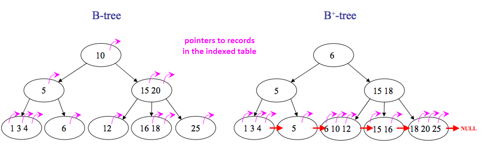

# 자료 구조 & 알고리즘

### 목차
- 시간 복잡도
  - 시간 복잡도, 공간 복잡도
  - Big-O 표기법
- 선형 구조
  - 배열과 링크드 리스트(Linked List)의 차이를 설명해주세요.
  - List와 Set의 차이에 대해서 설명해주세요.
  - Stack, Queue에 대해서 설명해주세요.
- Map 구조
  - Hash Function, HashTable에 대해서 설명해주세요.
  - 해시 충돌 및 해결 방법에 대해서 설명해주세요.
- Tree 구조
  - Tree, Binary Tree, BST, AVL Tree에 대해서 설명해주세요.
    - Full Binary Tree, Complete Binary Tree
    - Red-Black Tree
  - Heap, Priority Queue에 대해서 설명해주세요.
    - Binary Heap
  - [Database] B 트리, B+ 트리
  - BST의 최악의 경우의 예와 시간복잡도에 대해서 설명해주세요.
  - DFS, BFS에 대해서 설명해주세요.
- Graph 구조
  - Graph 용어 정리, Graph 구현
  - DFS, BFS에 대해서 설명해주세요.
- 정렬, 탐색
  - 정렬, 탐색에 대해 설명해주세요.
  - 버블 정렬, 선택 정렬, 삽입 정렬, 병합 정렬, 퀵 정렬, 힙 정렬
  - 순차 탐색 vs 이진 탐색

### 시간 복잡도
- [시간 복잡도](./time_complexity.md)
  - 시간 복잡도, 공간 복잡도
  - Big-O 표기법

### 선형 구조
- [Array vs Linked List](./list.md)
  - Floyd's Cycle Detection Algorithm
- [기본 자료구조](./ect_data_structure.md)
  - List vs Set
  - Stack vs Queue

### 해시 (Hash)

#### Hash Table
- [해시 테이블](./hash_table.md)
  - Hash Table 동작 방식
  - Hash Function
  - 해시 충돌 & 해결 방법

### Tree 구조

#### Tree 관련 용어

- 기본 용어
  - 노드(Node): 트리를 구성하는 기본 단위. 데이터와 다른 노드를 가리키는 포인터를 포함합니다.
  - 루트(Root): 트리의 최상위 노드입니다. 이 노드에서 모든 트리 순회가 시작됩니다.
  - 리프(Leaf): 자식 노드가 없는 노드를 의미합니다. Tree가 나무라면 리프 노드는 나뭇잎입니다.
  - 레벨(Level): 트리에서 같은 깊이에 있는 노드들의 집합을 나타냅니다. 예를 들어, 루트 노드는 보통 레벨 1(또는 레벨 0)에 있고, 그 자식 노드들은 레벨 2에 있습니다.
  - 서브 트리(Subtree): 특정 노드와 그 노드의 모든 자손 노드로 구성된 트리입니다. → 재귀적 구조로 이루어져 있습니다
  - 깊이(Depth): **특정 노드에서 루트 노드까지** 도달하기 위한 엣지(간선)의 수입니다.
  - 높이(Height): **특정 노드에서 가장 멀리 떨어진 리프 노드까지의 “최장 경로”의 길이**를 의미합니다. 다르게 말하면, 주어진 노드로부터 가장 먼 리프 노드까지 도달하기 위해 거쳐야 하는 엣지(간선)의 수입니다.

- 노드 간 관계
  - 부모(Parent) : 특정 노드의 상위 노드
    - 조상(Ancestor) : 특정 노드의 부모 노드, 조상 노드의 부모 노드를 모두 일겉는 말 (부모, 부모의 부모, ...)
  - 자식(Child) : 특정 노드의 하위 노드(들)
    - 자손(Descendant) : 특정 노드의 자식 노드, 자손 노드의 자식 노드를 모두 일겉는 말 (자식(들), 자식(들)의 자식(들), ...)
  - 형제(Sibling) : 같은 부모를 가지는 노드 간의 관계

- Tree 구조 예시 : HTML, 폴더 구조, ...

#### Tree의 종류

- Binary Tree (이진 트리) : 각 노드가 최대 2개의 자식을 가지는 관계
- Full Binary Tree : 모든 노드들은 0개 또는 2개의 자식을 가지는 이진 트리
- Complete Binary Tree
  - 가장 깊은 레벨을 제외한 다른 레벨은 최대한 많은 개수의 노드를 가지고 있어야 한다 (k 레벨에서 $2^k$개)
  - 가장 깊은 레벨에서는 노드가 최대한 왼쪽에 있어야 한다
  - 루트부터 시작하여 왼쪽 노드 순서로 이루어지는 배열로 사용할 수 있다 (Left child - `2i+1`, Right child - `2i+2`)
- BST (Binary Search Tree)
  - 특정 노드의 왼쪽 서브 트리에 있는 모든 값은 특정 노드가 가지고 있는 값보다 작다
  - 특정 노드의 오른쪽 서브 트리에 있는 모든 값은 특정 노드가 가지고 있는 값보다 크다
  - 이진 탐색과 유사한 구조로 사용할 수 있다
- AVL Tree
  - 스스로 균형을 잡는 이진 탐색 트리의 한 종류
  - 모든 노드의 왼쪽, 오른쪽 서브 트리의 높이 차이(Balance Factor의 절댓값)가 최대 1 이다
  - BST가 한쪽으로 치우쳐 탐색 속도가 느려지는 현상을 방지하기 위해 고안됨
  - 특정 원소 추가시 Balance Factor가 만족이 안될 경우, 회전을 통해 Balance Factor 값을 맞춘다
    - 참고 : [AVL 트리(Tree)](https://yoongrammer.tistory.com/72)
- Red-Black Tree
  - 스스로 균형을 잡는 이진 탐색 트리의 한 종류
  - 규칙 (추후 작성 예정)
  - 참고 : [레드 블랙 트리란?](https://suhwanc.tistory.com/197)

#### Heap

- Heap
- Binary Heap
- Priority Queue

#### B 트리, B+ 트리

- B Tree

- B+ Tree

### Graph 구조

- Graph : 객체 간의 관계를 정점(Vertex)과 간선(Edge)으로 나타내는 자료구조
  - 정점과 간선이 둘 중 하나 혹은 둘 다 없어도 그래프라고 할 수 있다
- Graph 종류
  - 무방향 그래프 (Undirected Graph) vs 방향 그래프 (Directed Graph)
    - 간선의 방향성에 따라 구분
  - 비가중 그래프 (Unweighted Graph) vs 가중 그래프 (Weighted Graph)
    - 간선마다 가중치가 모두 동일한지 다를 수 있는지에 따라 나눔
  - 비순환 그래프(Acyclic Graph) vs 순환 그래프(Cyclic Graph)
    - 그래프 내의 사이클이 유무에 따라 구분

#### Graph 관련 용어

- 정점(Vertex, 노드) : 하나의 객체(점)을 뜻한다
- 간선(Edge) : 두 정점의 연결을 뜻한다
- 인접 (Adjacent) : 두 노드(정점) 사이에 간선이 존재할 경우, 두 노드는 서로 '인접'되어 있다고 말한다
- 부속 (Incidnet) : 두 노드를 연결하는 간선은 해당 두 노드에 '부속'되어 있다고 합니다.
- 경로 (Path)
  - 정점 A (출발지)에서 정점 B (목적지)로 이어지는 일련의 간선들
  - 단순 경로 (Simple Path) : 는 동일한 노드를 중복해서 포함하지 않는 경로를 의미
  - 사이클 (Cycle) :  시작 노드와 종료 노드가 동일한 단순 경로 (최소 3개 이상의 간선으로 구성)
- 루프 (Loop) : 특정 노드에서 시작해서 동일한 노드로 끝나는 간선

#### Graph 구현 방법

- 인접 행렬(Adjacency Matrix)
  - 그래프의 정점들들 간의 연결 관계를 2차원 배열로 표현하는 방식
  - 정점 i와 정점 j가 연결되어 있으면 `matrix[i][j] = 1`, 그렇지 않으면 `matrix[i][j] = 0`으로 표시
  - 가중 그래프일 때, `1` 대신 가중치를 넣어준다
  - 장점 : 현 방법은 구현하기 쉽고, 두 정점 간의 연결 여부를 직관적으로 확인할 수 있다
  - 단점 : 정점은 많으면서 간선이 적은 희소 그래프의 경우, 공간을 비효율적으로 사용할 수 있다

- 인접 리스트(Adjacency List)
  - 각 정점이 인접하고 있는 정점을 연결 리스트(Linked List)로 표현하는 방식
  - 인접 리스트는 각 정점마다 해당 정점과 연결된 정점들의 리스트를 가진다
  - 장점 : 연결 리스트를 이용하여 노드별 인접 노드를 저장하는 방식은 메모리를 절약할 수 있다
  - 단점 : 연결이 많아지면 탐색 속도가 느려질 수 있다

#### DFS, BFS

- 깊이 우선 탐색 (Depth First Search, DFS)
  - 작 노드에서 시작하여 깊게 노드를 탐색하고, 더 이상 탐색할 노드가 없으면 이전 노드로 돌아와 계속하는 방식
  - “방문했던 정점을 저장하는 방법”이 추가되어야 무한 루프가 발생하지 않고 모든 정점을 방문할 수 있다.
    - 구현 : 방문했던 노드를 Set으로 관리
  - 주로 모든 정점을 방문하는 알고리즘으로 사용

- 너비 우선 탐색 (Breadth First Search, BFS)
  - 현재 레벨의 모든 노드를 방문한 후에 다음 레벨의 노드를 방문하는 방식
  - 구현 : Queue를 이용하여 다음 방문할 지점을 추가, Set을 이용하여 이미 방문한 노드를 관리
  - 주로 최소 경로 찾을 때 사용함 (
    ex. [Dijkstra’s Algorithm](https://velog.io/@gwichanlee/%EC%B5%9C%EB%8B%A8%EA%B1%B0%EB%A6%AC-Graph))

### 정렬, 탐색 알고리즘

#### 이진 탐색
- 순차 탐색
- 이진 탐색

#### 정렬 알고리즘
- 버블 정렬
  - 서로 인접한 두 원소를 검사하여 정렬하는 알고리즘
    - 인접한 2개의 레코드를 비교하여 크기가 순서대로 되어 있지 않으면 서로 교환한다.
  - 시간 복잡도 : $O(n^2)$
    - 맨 앞부터 맨 뒤까지 비교하는 것을 n번 반복한다
- 선택 정렬
  - 가장 작은 값을 선택하여 (맨) 앞의 원소와 자리를 바꾸는 방법
    - 처음에는 `1 ~ n` 까지 탐색하고, 두 번째는 `2 ~ n`까지 탐색, ...
  - 시간 복잡도 : $O(n^2)$
    - `1 ~ n`, `2 ~ n`, ..., `n-1 ~ n` 탐색이 필요
- 삽입 정렬
  - 이미 정렬된 크기가 1인 배열에 하나씩 원소를 “삽입”하여 정렬된 크기가 n인 배열을 만드는 알고리즘
  - 시간 복잡도 : $O(n^2)$
- 병합 정렬
  - 배열을 더 작은 배열로 분할할 후에 각 부분 배열을 정렬하고 병합하는 과정을 반복하는 알고리즘
    - 분할 정복(Divide and Conquer)과 재귀(Recursion) 알고리즘을 사용한 정렬 방법
  - 시간 복잡도 : $O(nlogn)$
- [퀵 정렬](https://gmlwjd9405.github.io/2018/05/10/algorithm-quick-sort.html)
  - 임의의 pivot 정하고, 나머지 원소를 앞 뒤로 배치함
  - 최악의 경우 $O(n^2)$이지만, 일반적인 경우에는 $O(nlogn)$ 이며 가장 빠르다.
- 힙 정렬
  - Heap 자료 구조를 이용하여 Priority Queue를 이용
  - 모든 값을 Priority Queue에 넣은 후에, 하나씩 자료를 빼서 정렬함

### 참고 자료
- [이소진/ C++/백준 1260 DFS와 BFS](https://velog.io/@513sojin/C%EB%B0%B1%EC%A4%80-1260-DFS%EC%99%80BFS)
