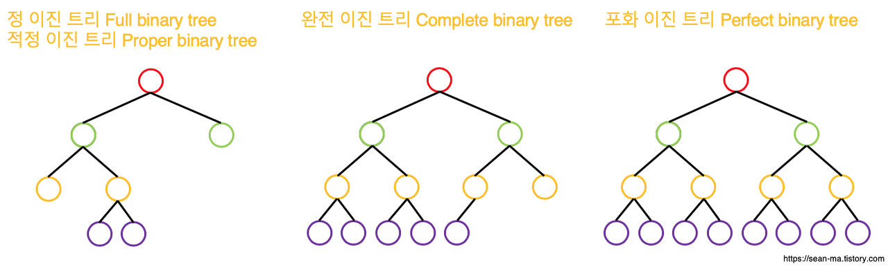

# 자료 구조 & 알고리즘

- [선형 구조](#선형-구조)
  - 배열과 링크드 리스트(Linked List)의 차이를 설명해주세요.
  - List와 Set의 차이에 대해서 설명해주세요.
  - Stack, Queue에 대해서 설명해주세요.
- [Map 구조](#map-구조)
  - Hash Function, HashTable에 대해서 설명해주세요.
  - 해시 충돌 및 해결 방법에 대해서 설명해주세요.
- [Tree 구조](#tree-구조)
  - Tree, Binary Tree, BST, AVL Tree에 대해서 설명해주세요.
      - Full Binary Tree, Complete Binary Tree
      - Red-Black Tree
  - Heap, Priority Queue에 대해서 설명해주세요.
    - Binary Heap
  - [Database] B 트리, B+ 트리
  - BST의 최악의 경우의 예와 시간복잡도에 대해서 설명해주세요.
  - DFS, BFS에 대해서 설명해주세요.
- [Graph 구조](#graph-구조)
  - Graph 용어 정리, Graph 구현
  - DFS, BFS에 대해서 설명해주세요.

- 알고리즘
  - 피보나치 수열을 코드로 구현하는 방법에 대해서 설명해주세요.
  - Prime Number Algorithm
- 정렬, 탐색
  - 정렬, 탐색에 대해 설명해주세요.
  - 버블 정렬, 선택 정렬, 삽입 정렬, 병합 정렬, 퀵 정렬, 힙 정렬
  - 순차 탐색 vs 이진 탐색

### 선형 구조

#### Array vs Linked List
- Array
  - 같은 타입의 여러 변수를 하나의 묶음으로 다루는 자료구조
  - **연속적인 메모리 공간**에 데이터가 저장되며, 크기가 고정되어 있다
  - 크기를 동적으로 변경하기 어려움, 동적 배열을 사용할 수 있으나 가득 차면 배열을 2배로 늘려서 공간을 확보해야 한다
- Linked List
  - 데이터 요소들이 순서대로 연결되어 있는 선형 자료 구조
  - 원소가 추가될 때마다 공간을 할당받아 **비연속적인 메모리 공간에 추가**
  - 크기가 동적으로 조정 가능해서 공간 효율적
  - 각 요소(Node)는 데이터와 다음 요소를 가리키는 포인터(주소)로 이루어진다.
    - Node의 구성에 따라 Singly Linked List, Doubly Linked List가 될 수 있다

- Linked List의 순환 여부 판단 (Floyd's Cycle Detection Algorithm)
  - 빠른 포인터(hare)와 느린 포인터(tortoise)를 구성
  - 빠른 포인터는 두 개의 노드를 건너뛰고, 느린 포인터는 한 번에 하나의 노드를 건너뛴다
  - 만약 Linked List에 사이클이 없다면, 빠른 포인터가 끝에 도달하게 된다
  - 만약 Linked List에 사이클이 있다면, 빠른 포인터와 느린 포인터가 같은 노드를 가리키게 된다

#### List vs Set
- List
  - 같은 타입의 여러 변수를 **순서있게** 다루는 자료구조
  - 순서가 존재하기 때문에 같은 값을 중복으로 가질 수 있다
- Set
  - 같은 타입의 여러 변수를 **순서없이** 다루는 자료구조
  - 같은 값을 중복으로 허용하지 않는다
  - `contains()`와 같은 탐색이 필요하다면 Set을 고려하는 것이 좋음 (HashSet - O(1))

#### Stack vs Queue
- Stack
  - LIFO (Last In First Out, 후입선출) 원칙에 기반한 선형 자료구조
  - ex) 최근 작업 순서로 되돌아가기, 프로그램의 함수 호출 관리, 웹 브라우저 뒤로 가기
  - 배열이나 링크드 리스트를 통해 구현
- Queue
  - FIFO (First In First Out, 선입선출) 원칙을 따르는 선형 자료구조
  - ex) CPU 스케줄링, 프린터 대기열, 주문 처리 시스템
  - Circular Queue : 배열로 Queue를 구현했을 때 원소가 들어오고 나감에 따라 빈공간이 생기는 것을 방지하기 위해, `(rear + 1) % n`을 통해 다음 위치를 찾도록 하여 배열을 원형으로 사용하도록 함
    - 배열의 값들을 전부 옮겨야 하는 작업이 없어지면서, 시간이 줄어든다

### Map 구조

#### Hash Table
- Hash Table
  - Key-value 형태의 값을 저장하고 검색
  - 검색 / 삽입 / 삭제 작업에 효율적인 자료구조 (시간복잡도 O(1))
- Hash Table 동작 방식
  - key 값을 크기에 맞는 적절한 인덱스로 변환한다
  - 배열의 해당 인덱스 위치에 `Entry<Key, Value>` 형식으로 저장한다

#### Hash Function
- Hash Function
  - 입력된 Key를 table의 크기에 적합한 인덱스 값으로 변환하는 함수 (`0 <= hash(key) < N`)
  - 가장 간단하게는 모듈러 연산으로 구현할 수 있으며, 입력 받는 키 값에 따라 다양한 값이 나오도록 하는 것이 좋다
- Hash Table의 크기
  - 주로 "$$2^n$$에 가깝지 않은 소수(prime number)”를 선택하는 것이 좋다
  - 모듈러 연산 결과가 더 다양하게 나와 데이터가 더 고르게 분포됨으로써 효율적인 해시 테이블 작동을 도와줍니다

#### 해시 충돌 & 해결 방법
- **Hash Collision이 발생하는 이유**
  - 해시 테이블의 크기에 비해 key 값이 가질 수 있는 종류가 더 클 경우, 다른 key가 같은 해시 값을 가질 수 있다
  - 이때 특정 배열의 같은 위치에 두 개 이상의 값이 저장되고자 할 때, 해시 충돌이 발생한다

- 해결 방법 1. Separate Chaning
  - 같은 주소로 해싱되어 충돌이 일어나는 Entry를 연결 리스트(Linked List)로 연결해서 저장하는 방식
  - 임의의 키에 해당하는 엔트리를 저장할 때는 해시값이 가리키는 bucket의 연결 리스트의 맨 앞이나 맨 뒤에 삽입한다
- 해결 방법 2. Open Addressing
  - 정해진 규칙에 의해 다음 자리를 찾아 저장하는 방식
  - 탐색 방법
    - 해시 함수를 통해 인덱스를 찾고, 해당 위치의 key가 일치하지 않을 경우 다음 주소로 가서 비교함
    - 빈 자리가 나올 때까지 반복
  - 저장
    - 해시 함수를 통해 인덱스를 찾고, 해당 위치에 이미 저장된 원소가 있을 경우 다음 주소로 간다
    - 빈 자리가 나올 때까지 반복
  - 삭제 주의사항
    - 해당 원소를 찾아서 삭제한 후에, 특정 원소가 삭제되었다도 표기해주어야 한다
    - 탐색 시에 삭제되어 있는 자리를 보고 존재하지 않는다고 판단할 수 있기 때문이다

- Open Addressing 에서 충돌이 일어났을 때, 다음 주소를 정하는 방법
  - 선형 탐색 (Linear Probing)
    - k(N 이하의 자연수)만큼 이동한 다음 인덱스 (`next = (current + k) % N`)
    - 문제점 : 특정 영역에 키가 몰리면(군집 현상) 탐색 횟수가 늘어나 성능이 떨어진다 
  - 이차원 탐색 (Quadratic Probing)
    - 이차 함수를 이용하여 다음 인덱스를 구하는 방식
    - 군집 현상을 완화할 수 있다
  - 더블 해싱 (Double Hashing)
    - 현재 인덱스를 다시 (기존과 다른) 해시 함수에 넣어 다음 인덱스를 구하는 방식

### Tree 구조

#### Tree 관련 용어

- 노드(Node): 트리를 구성하는 기본 단위. 데이터와 다른 노드를 가리키는 포인터를 포함합니다.
- 루트(Root): 트리의 최상위 노드입니다. 이 노드에서 모든 트리 순회가 시작됩니다.
- 리프(Leaf): 자식 노드가 없는 노드를 의미합니다. Tree가 나무라면 리프 노드는 나뭇잎입니다.
- 레벨(Level): 트리에서 같은 깊이에 있는 노드들의 집합을 나타냅니다. 예를 들어, 루트 노드는 보통 레벨 1(또는 레벨 0)에 있고, 그 자식 노드들은 레벨 2에 있습니다.
- 서브트리(Subtree): 특정 노드와 그 노드의 모든 자손 노드로 구성된 트리입니다. → 재귀적 구조로 이루어져 있습니다
- 깊이(Depth): **특정 노드에서 루트 노드까지** 도달하기 위한 엣지(간선)의 수입니다.
- 높이(Height): **특정 노드에서 가장 멀리 떨어진 리프 노드까지의 “최장 경로”의 길이**를 의미합니다. 다르게 말하면, 주어진 노드로부터 가장 먼 리프 노드까지 도달하기 위해 거쳐야 하는 엣지(간선)의 수입니다.

- 노드 간 관계
  - 부모(Parent) : 특정 노드의 상위 노드
    - 조상(Ancestor) : 특정 노드의 부모 노드, 조상 노드의 부모 노드를 모두 일겉는 말 (부모, 부모의 부모, ...)
  - 자식(Child) : 특정 노드의 하위 노드(들)
    - 자손(Descendant) : 특정 노드의 자식 노드, 자손 노드의 자식 노드를 모두 일겉는 말 (자식(들), 자식(들)의 자식(들), ...)
  - 형제(Sibling) : 같은 부모를 가지는 노드 간의 관계

- Tree 구조 예시 : HTML, 폴더 구조, ...

#### Tree의 종류

<center></center>

- Binary Tree (이진 트리) : 각 노드가 최대 2개의 자식을 가지는 관계
- Full Binary Tree : 모든 노드들은 0개 또는 2개의 자식을 가지는 이진 트리
- Complete Binary Tree
  - 가장 깊은 레벨을 제외한 다른 레벨은 최대한 많은 개수의 노드를 가지고 있어야 한다 (k 레벨에서 $$2^k$$개)
  - 가장 깊은 레벨에서는 노드가 최대한 왼쪽에 있어야 한다
  - 루트부터 시작하여 왼쪽 노드 순서로 이루어지는 배열로 사용할 수 있다 (Left child - `2i+1`, Right child - `2i+2`)
- BST (Binary Search Tree)
  - 특정 노드의 왼쪽 서브 트리에 있는 모든 값은 특정 노드가 가지고 있는 값보다 작다
  - 특정 노드의 오른쪽 서브 트리에 있는 모든 값은 특정 노드가 가지고 있는 값보다 크다
  - 이진 탐색과 유사한 구조로 사용할 수 있다
- AVL Tree
  - 이진 트리의 한 종류
  - 모든 노드의 왼쪽, 오른쪽 서브 트리의 높이 차이(Balance Factor의 절댓값)가 최대 1 이다
  - BST가 한쪽으로 치우쳐 탐색 속도가 느려지는 현상을 방지하기 위해 고안됨
  - 특정 원소 추가시 Balance Factor가 만족이 안될 경우, 회전을 통해 Balance Factor 값을 맞춘다
    - 참고 : [AVL 트리(Tree)](https://yoongrammer.tistory.com/72)
- Red-Black Tree
  - 

#### Heap

- Heap
  - Binary Heap
- Priority Queue

#### B 트리, B+ 트리

### Graph 구조

- Graph : 객체 간의 관계를 정점(Vertex)과 간선(Edge)으로 나타내는 자료구조
    - 정점과 간선이 둘 중 하나 혹은 둘 다 없어도 그래프라고 할 수 있다
- Graph 종류
  - 무방향 그래프 (Undirected Graph) vs 방향 그래프 (Directed Graph)
    - 간선의 방향성에 따라 구분
  - 비가중 그래프 (Unweighted Graph) vs 가중 그래프 (Weighted Graph)
    - 간선마다 가중치가 모두 동일한지 다를 수 있는지에 따라 나눔 
  - 비순환 그래프(Acyclic Graph) vs 순환 그래프(Cyclic Graph)
    - 그래프 내의 사이클이 유무에 따라 구분

#### Graph 관련 용어
- 정점(Vertex, 노드) : 하나의 객체(점)을 뜻한다
- 간선(Edge) : 두 정점의 연결을 뜻한다
- 인접 (Adjacent) : 두 노드(정점) 사이에 간선이 존재할 경우, 두 노드는 서로 '인접'되어 있다고 말한다
- 부속 (Incidnet) : 두 노드를 연결하는 간선은 해당 두 노드에 '부속'되어 있다고 합니다.
- 경로 (Path)
  - 정점 A (출발지)에서 정점 B (목적지)로 이어지는 일련의 간선들
  - 단순 경로 (Simple Path) : 는 동일한 노드를 중복해서 포함하지 않는 경로를 의미
  - 사이클 (Cycle) :  시작 노드와 종료 노드가 동일한 단순 경로 (최소 3개 이상의 간선으로 구성)
- 루프 (Loop) : 특정 노드에서 시작해서 동일한 노드로 끝나는 간선

#### Graph 구현 방법

<center></center>

- 인접 행렬(Adjacency Matrix)
  - 그래프의 정점들들 간의 연결 관계를 2차원 배열로 표현하는 방식
  - 정점 i와 정점 j가 연결되어 있으면 `matrix[i][j] = 1`, 그렇지 않으면 `matrix[i][j] = 0`으로 표시
  - 가중 그래프일 때, `1` 대신 가중치를 넣어준다
  - 장점 : 현 방법은 구현하기 쉽고, 두 정점 간의 연결 여부를 직관적으로 확인할 수 있다
  - 단점 : 정점은 많으면서 간선이 적은 희소 그래프의 경우, 공간을 비효율적으로 사용할 수 있다

- 인접 리스트(Adjacency List)
  - 각 정점이 인접하고 있는 정점을 연결 리스트(Linked List)로 표현하는 방식
  - 인접 리스트는 각 정점마다 해당 정점과 연결된 정점들의 리스트를 가진다
  - 장점 : 연결 리스트를 이용하여 노드별 인접 노드를 저장하는 방식은 메모리를 절약할 수 있다
  - 단점 : 연결이 많아지면 탐색 속도가 느려질 수 있다

#### DFS, BFS
- 깊이 우선 탐색 (Depth First Search, DFS)
  - 작 노드에서 시작하여 깊게 노드를 탐색하고, 더 이상 탐색할 노드가 없으면 이전 노드로 돌아와 계속하는 방식
  - “방문했던 정점을 저장하는 방법”이 추가되어야 무한 루프가 발생하지 않고 모든 정점을 방문할 수 있다.
    - 구현 : 방문했던 노드를 Set으로 관리
  - 주로 모든 정점을 방문하는 알고리즘으로 사용

- 너비 우선 탐색 (Breadth First Search, BFS)
  - 현재 레벨의 모든 노드를 방문한 후에 다음 레벨의 노드를 방문하는 방식
  - 구현 : Queue를 이용하여 다음 방문할 지점을 추가, Set을 이용하여 이미 방문한 노드를 관리
  - 주로 최소 경로 찾을 때 사용함 (ex. [Dijkstra’s Algorithm](https://velog.io/@gwichanlee/%EC%B5%9C%EB%8B%A8%EA%B1%B0%EB%A6%AC-Graph))

### 알고리즘

#### 피보나치 수열

- 꼬리 재귀
    - 일반적인 재귀를 이용하지 않는 이유 : 시간 복잡도가 $$O(n^2)$$이 되기 때문이다
    ```java
    public class FibonacciStairs {
        public static void main(String[] args) {
            int n = 10;
            System.out.println(fibonacci(n));
        }
    
        public static int fibonacci(int input) {
            return fibonacci(input, 0, 1);
        }
    
        public static int fibonacci(int input, int before, int after) {
            if (input <= 1) {
                return after;
            }
            return fibonacci(input - 1, after, before + after);
        }
    }
    ```

- 반복문
    ```java
    public class FibonacciStairs {
    
        public static void main(String[] args) {
            int n = 10;
            System.out.println(fibonacci(n));
        }
    
        public static int fibonacci(int n) {
            int answer = 0;
            if (n <= 1)
                return n;

            int prevPrev = 0;
            int prev = 1;

            for (int i = 2; i <= n; i++) {
                answer = prev + prevPrev;
                prevPrev = prev;
                prev = answer;
            }
            return answer;
        }
    }
    ```

#### Prime Number Algorithm
```java
public class PrimeNumber {

    public static void main(String[] args) {
        int n = 109;
        System.out.println(isPrime(n)); // true
    }

    public static boolean isPrime(int n) {
        if (n <= 1) {
            return false;
        }

        for (int i = 2; i * i <= n; i++) {
            if (n % i == 0) {
                return false;
            }
        }
        return true;
    }
}
```

### 참고 자료
- [이소진/ C++/백준 1260 DFS와 BFS](https://velog.io/@513sojin/C%EB%B0%B1%EC%A4%80-1260-DFS%EC%99%80BFS)
