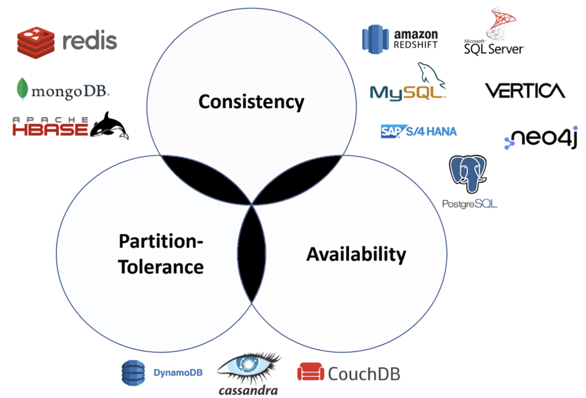

# Database

- RDBMS vs NoSQL
  - RDBMS vs NoSQL에 대해서 설명해주세요.
  - RDBMS 정의
  - NoSQL 정의, 저장 방식에 따른 분류
- DB 성능 중요 요소
- Index
    - Index란 무엇인가요?
    - 데이터베이스에서 인덱스를 사용하는 이유 및 장단점에 대해 설명해주세요.
    - Index 자료구조
    - Primary index vs Secondary index, Composite index
    - Index의 성능과 고려해야할 사항
- 트랜잭션
    - 트랜잭션에 대해서 설명해주세요.
    - 트랜잭션 격리 수준(Transaction Isolation Levels)에 대해서 설명해주세요.
    - ACID에 대해서 설명해주세요.
    - 특성, Lock, 상태, 주의할 점
    - cf) [DBMS는 어떻게 트랜잭션을 관리할까?](https://d2.naver.com/helloworld/407507)
- 정규화
    - 정규화에 대해서 설명해주세요.
    - 탄생 배경, 정의, 종류, 장단점
- JOIN에 대해서 설명해주세요.
- Statement vs PreparedStatement
- CAP 이론과, Eventual Consistency에 대해서 설명해주세요.
- 대표적인 NoSQL의 종류
  - Redis에 대해서 간단히 설명해주세요.
  - MongoDB에 대해서 간단히 설명해주세요.
  - Redis와 Memcached의 차이에 대해서 설명해주세요.
- ElasticSearch
  - ElasticSearch에 대해서 간단히 설명해주세요.
  - ElasticSearch의 인덱스 구조와 RDBMS의 인덱스 구조의 차이에 대해 설명해주세요.
  - ElasticSearch의 키워드 검색과 RDBMS의 LIKE 검색의 차이에 대해 설명해주세요.

### RDBMS vs NoSQL

#### RDBMS (Relational Database Management System)

- DBMS : 응용 프로그램과 데이터 사이의 중재자로서 모든 응용 프로그램(사용자)들이 데이터베이스를 **공용할 수 있게 관리**해 주는 범용 소프트웨어 시스템
    - 논리적 데이터 독립성 : 응용 프로그램에 영향을 주지 않고 논리적 데이터 구조의 변경이 가능
    - 물리적 데이터 독립성 : 응용 프로그램과 논리적 데이터 구조에 영향을 주지 않고 물리적 데이타 구조의 변경이 가능
- RDBMS : 관계형 데이터베이스를 관리하는 DBMS
    - 관계형 모델
        - 수학에서의 릴레이션(relation)과 집합(set) 이론에 기초, 일반 사용자는 테이블(table) 형태로 생각
        - 데이터가 하나 이상의 열과 행의 테이블(또는 '관계')에 저장되어 서로 다른 데이터 구조가 어떻게 관련되어 있는지 쉽게 파악하고 이해할 수 있도록 사전 정의된 관계

#### NoSQL (Not only SQL)

- NoSQL : 관계형 모델이 아닌 데이터베이스를 관리하는 DBMS
- NoSQL의 종류
    - Key-Value Model : key-value pair로 데이터를 저장함, key는 unique identifier로도 사용됨 ex) Redis, DynamoDB
    - Document Model : JSON, XML 등 자유로운 형태로 데이터를 저장함 ex) MongoDB
    - Graph Model : 데이터를 graph의 형태로 저장, 각 항목이 node로 이루어져있고 node간의 관계는 edge를 사용해서 나타냄 ex) Neo4J, OrientDB

#### RDBMS vs NoSQL

| 구분             | RDBMS (관계형 DB)                                                      | NoSQL (비관계형 DB)                                                                |
|----------------|---------------------------------------------------------------------|--------------------------------------------------------------------------------|
| Data Modeling  | - 스키마에 맞춰서 관리하기 때문에 데이터 정합성 보장   - 관계를 맺고있는 데이터가 자주 변경되는 경우 | - 자유롭게 데이터를 관리할 수 있다   - 데이터 구조를 정확히 알 수 없는 경우   - 데이터가 변경/확장될 수 있는 경우 |
| Scalability    | Scale Up   각 단일 서버의 성능을 증가시켜서 더 많은 요청을 처리 (한계가 존재함)             | Scale Out   요청량이 증가하더라도 동일하거나 비슷한 사양의 새로운 하드웨어를 추가                         |
| Query Language | SQL(Structured Query Language)                                      | DB마다 문법이 다름                                                                    |
| Consistency    | STRONG                                                              | eventual consistency   - may take time to be consistent                    |
| flexibility    | 상대적으로 떨어짐                                                           | 매우 유연함                                                                         |

### 데이터베이스 성능 중요 요소

- 데이터베이스의 성능 향상의 초점은 디스크 (랜덤) 접근 횟수(I/O)의 최소화
    - **인덱스 최적화**와 **SQL 최적화**의 우선순위가 높다.
- 인덱스 최적화
    - 인덱스를 통해 정렬되어 있는 자료에서 찾으므로써 디스크 접근 횟수를 줄일 수 있다.
    - 하단의 인덱스 부분 참고
- 질의어 최적화 과정
    - 질의문의 내부 표현 : 질의문 내부 표현 형태는 보통 트리 구조로 표현 가능
    - 효율적인 내부 형태로 변환 : 질의문 내부 표현을 동등하면서도 처리에 효율적인 형태로 변환시킨다
        - 연산 비용이 큰 Join 전에 데이터의 크기를 줄이는 연산을 먼저 함으로써 Join 연산을 최소한의 데이터로 진행한다.
    - 후보 프로시저 선정 : 주어진 내부 표현을 일련의 저급 연산(조인 프로시저, 셀렉트 프로시저) 등으로 명세하는 것
    - 질의문 계획의 평가 및 결정 : 주로 **디스크 입출력의 횟수**를 바탕으로 통계적으로 계산한 비용식을 바탕으로, 최소 비용의 계획을 결정

### 인덱스 (Index)
- [인덱스](./index.md)
  - 장단점, 사용 시 고려해야 할 점
  - Primary index vs Secondary index, Composite index
- [인덱스 자료구조](./index_data_structure.md)

### 트랜젝션 (Transaction)

- [트랜젝션 정의 & 특징](./transation.md)
- [트렌젝션 격리 수준 (Isolation Level)](./transaction_isolation_level.md)
  - MVCC
- [데드락](./deadlock.md)

#### 트렌젝션 상태

- Active State (활동 상태)
    - Transaction이 진행중인 상태
    - 읽기 또는 쓰기가 정상적으로 진행된 경우, “Partially Committed State”
    - 읽기 또는 쓰기가 실패한 경우, “Failed State”
- Partially Committed State (부분 완료 상태)
    - 모든 읽기 쓰기 데이터가 DB에 저장된 경우 “committed state”로 이동
    - DB에 저장이 실패한 경우, “Failed State”
- Failed State (실패 상태)
    - Transaction의 명령이 실패하거나 DB에 데이터 저장, 변경에 실패한 경우
- Aborted State (철회 상태)
    - local buffer 또는 main memory에 있는 변경 사항들을 지우거나 롤백함
- Committed State (완료 상태)
    - DB에 모든 내용이 저장된 상태
- Terminated State
    - 롤백이나 다른 커밋 상태가 없을 때
    - 이전에 있었던 transaction은 지우고 새로운 transaction에 대기하는 상태

#### Lock

- 잠금이 된 데이타 집합을 생성
    - 잠금이 된 데이터는 다른 트랜젝션에서 사용할 수 없으며, 잠근 트랜젝션에서만 풀 수 있다
- 공용 락 (lock-S, Shared), 독점 락 (lock-X, exclusive)이 있으며, 공용 락에서는 읽기만 전용 락에서는 읽기, 쓰기 연산이 모두 가능
    - 공용 락들은 서로 양립할(같은 데이터에 접근할) 수 있지만, 이외의 경우는 다른 트랜젝션은 대기하여야 한다
- 문제점 : **교착 상태**가 발생 할 수 있다.
    - 교착 상태의 필요충분조건 : 상호 배제, 대기, 선취 금지, 순환 대기
    - 해결책 : 탐지 (교착 발생 조건의 하나를 제거), 회피 (실시간 알고리즘 검사), 예방 (적당량 이상의 자원 분배)

- 여러 locking 규약 들
    - 2PLP (2단계 로킹 규약)
        - 확장 단계(lock만 가능)와 축소 단계(unlock만 가능)로 구성
        - 특정 경우에서 연쇄 복귀 문제(Cascading Rollback)가 발생할 수 있다
    - strict 2PLP
        - 모든 독점 락(lock-X)는 그 트랜젝션이 완료할 때까지 unlock하지 않아야 한다
        - 완료하지 않은 어떤 트랜잭션에 의해 기록된 모든 데이타는 그 트랜잭션이 완료할 때까지 독점 모드로 로킹
        - 연쇄 복귀 문제가 일어나지 않는다
    - rigorous 2PLP
        - 모든 락(lock-X, lock-S)는 그 트랜젝션이 완료할 때까지 unlock하지 않아야 한다
    - 대부분의 상용 DBMS에서는 strict 2PLP나 rigorous 2PLP를 사용한다

#### 주의할 점

- 트랜잭션은 꼭 필요한 최소한의 코드에만 적용하는 것이 좋다. 즉, 트랜잭션의 범위를 최소화하라는 말이다.

### 정규화 (Normalization)

- 정규화 관계형 데이터베이스의 설계에서 중복을 최소화하게 데이터를 구조화하는 프로세스
- 목표 : 이상(갱신, 삽입, 삭제 이상)이 있는 관계를 재구성하여 작고 잘 조직된 관계를 생성하는 것, 데이터의 무결성(데이터의 정확성과 일관성)을 유지
- 목적 : 하나의 테이블에서의 데이터의 삽입, 삭제, 변경이 정의된 관계들로 인하여 데이터베이스의 나머지 부분들로 전파되게 하는 것

#### 정규화 단계 (종류)
아래로 내려갈수록 이상 현상(갱신, 삽입, 삭제 이상)이 일어나지 않는다. (점차 보완된다)

- 제 1 정규화 (1NF, First Normal Form)
  - 모든 도메인이 원자 값(atomic value)만으로 된 릴레이션
- 제 2 정규화 (2NF, Second Normal Form)
  - 1NF를 만족하면서 모든 컬럼이 완전 함수 종속을 만족하도록 테이블을 분해
  - 완전 함수 종속 : 기본키의 부분집합이 결정자가 되어선 안 된다는 것
- 제 3 정규화 (3NF, Third Normal Form)
  - 2NF를 만족하면서 기본키를 제외한 속성들간의 이행 종속성(Transitive Dependency)이 없어야 한다
  - ex) [**ID**(PK), 등급, 할인율] 에서 종속 관계가 'ID' -> '등급' -> '할인율'일 때 '이행 종속성'이라고 한다
- BCNF (Boyce/Codd Normal Form)
  - 3NF를 만족하면서 결정자(Determinant)가 후보키(Alternative Key)로 취급하게 함
    - 후보 키 : 유일성(각 행 별로 모두 다름)과 최소성(집합 개수가 최소)을 만족하는 애트리뷰트(컬럼) 집합
  - ex) [**학번, 과목 명**(PK), 담당 교수]에서 종속 관계가 [학번, 과목명] -> '담당 교수' -> '과목 명' 인 경우, 결정자('담당 교수')가 후보 키로 사용되지 아니함

#### 정규화 장단점

|    구분     | 정규화                                                 | 비정규화                    |
|:---------:|-----------------------------------------------------|-------------------------|
|  **장점**   | 데이터의 불일치가 생기지 않는다.                                  | 참조없이 읽기가 가능             |
|    단점     | 읽을 때는 항상 원본 데이터를 참조   조회할 때마다 JOIN 연산을 많이 해야 한다 | 데이터 정합성 유지가 어려움         |
| trade off | 수정을 용이하게 하나 조회를 힘들게 한다.                             | 조회를 용이하게 하나 수정을 힘들게 한다. |

### JOIN

### CAP 이론

- CAP Theorem
    - 각각의 DB는 Consistency, Availability, Partition-torlerance 의 특징중에 2가지에 특징에 강점을 둔다.
    - 3가지를 모두 만족하는 DB는 존재하기 힘들다.

- Consistency (일관성)
    - 데이터베이스 안의 모든 노드들이 같은 값을 가지고 있음
    - 요청를 보내면 해당 응답이 지연 될 수 있음
    - 예시 : 금융 (데이터의 정확하고 일관성 있어야 한다.)

- Availability (가용성)
    - 데이터베이스에 요청를 보내면 항상 응답을 받음
        - 일관성이 강조된 DB는 응답을 바로 받올 수 있다.
    - 하지만 해당 응답이 가장 최근 데이터라는 것을 보장받을 수 없음
    - 접근하는 노드에 따라 값이 다르다

- Partition-torlerance (분산 처리)
    - 노드간 소통이 불가능 하더라도 정상적으로 작동함

### 대표적인 NoSQL의 종류

#### Redis

- 인메모리 데이터베이스, key-value 데이터 모델 기반의 데이터베이스
- 기본적인 데이터 타입은 string 이며 최대 512MB까지 저장할 수 있다
- 지원하는 기능
  - pub/sub(publish/subscribe) 기능을 통한 채팅 시스템
  - 캐싱 기능, 세션 정보 관리
  - 정렬된 셋(sorted set) 자료 구조를 이용한 실시간 순위표 서비스

#### MongoDB

- Document 기반의 데이터베이스
  - JSON을 통해 데이터에 접근할 수 있다
  - Binary JSON (BSON) 형태로 데이터가 저장
- 장점 : 확장성이 뛰어나며 빅데이터를 저장할 때 성능이 좋고 고가용성과 샤딩, 레플리카 셋을 지원
  - 확장성 : 데이터와 트래픽 증가에 따라 데이터를 샤딩하여 수평 확장(scale-out) 할 수 있음
    - 샤딩 : 서버를 여러 개를 두고 분산 저장한다면 I/O 가 여러 대에서 일어나기 때문에 효율이 좋아진다
  - 고가용성 : IT 시스템이 다운타임을 제거하거나 최소화하여 거의 100% 상시 액세스 가능하고 신뢰성을 유지하는 능력
    - 레플리카 셋 : 한 개의 Primary와 두 개 이상의 Secondary로 구성
    - Primary에만 쓸 수 있고, Primary에서 Secondary로 Replication 실시
    - Primary가 중단될 경우, 투표를 통해 Secondary 중 하나가 Primary가 된다
- ObjectID
  - 도큐먼트를 생성할 때마다 다른 컬렉션에서 중복된 값을 지니기 힘든 유니크한 ObjectID가 생성됨
  - 유닉스 기반의 타임스탬프 (4바이트), 랜덤 값 (5바이트), 카운터 (3바이트)로 이루어져 있다.
- 기타
  - 와이어드타이거 엔진이 기본 스토리지 엔진으로 장착
  - [MongoDB를 선택하는 가장 큰 이유](https://fastcampus.co.kr/story_article_yhs?gad_source=1&gclid=CjwKCAiA7t6sBhAiEiwAsaieYiXLRBo6sWvi4xi7tcyCUq5QptbvMseiSAjyOG8VyCUq3vChDHNrsRoCXg4QAvD_BwE) : 자유로운 스키마, 편리한 확장, 다양한 종류의 Index

#### Redis vs Memcached

- 공통점
  - in-memory cache이다.
  - key-value 저장소이다. (redis는 데이터 구조저장소 성격에 가까움)
  - 데이터관리를 위해 NoSQL을 사용한다
  - RAM에 데이터를 보관한다

- Redis
  - 다양한 자료구조 및 용량 지원 : hash, set, list, string 등 다양한 데이터 구조를 지원
  - 다양한 삭제 정책 지원 : 캐시의 남은 용량에 따라 6가지의 다른 데이터 삭제 정책을 제공
  - 디스크 영속화(persistence) 지원 : 디스크 영구 저장 기능 지원 (스냅샷 형식, 로그 형식)
    - 해당 데이터를 통해 원 상태로 복구할 수 있다
  - 복제(replication) 지원 : 하나 이상의 레플리카를 가질 수 있다
  - 트랜잭션(Transaction) 지원
    - `MULTI` 커맨드를 통해서 트랜잭션을 시작하며 `EXEC`로 추가 명령어를 실행합니다. `WATCH`를 통해서 트랜잭션을 종료합니다.

- Memcached
  - 정적 데이터 캐싱에 효과적
    - 내부 메모리관리는 단순한 경우에 매우 뛰어나다
    - Strings(유일한 지원 데이터 타입)은 추가처리가 필요없어 읽기 전용에 적합
  - 멀티 스레드 지원
    - Memcached는 멀티쓰레드이기 때문에, Redis에 비해 스케일링에 유리하다
    - 컴퓨팅 자원을 추가함으로 스케일 업을 할 수 있다
    - 캐시된 데이터를 유실 할 확률도 높다

### ElasticSearch

- Apache Lucene 기반의 java 오픈소스 분산 검색 엔진
- 방대한 양의 데이터를 신속하고 거의 실시간으로 저장, 검색, 분석할 수 있다
- 검색을 위해 단독으로 사용되기도 하며, ELK(Elasticsearch / Logstatsh / Kibana) 스택으로 사용하기도 한다

#### ElasticSearch 인덱스 구조 vs RDBMS 인덱스 구조

- 
- RDBMS 인덱스 구조 : B 트리, B+ 트리 구조

#### ElasticSearch 키워드 검색 vs RDBMS LIKE query
