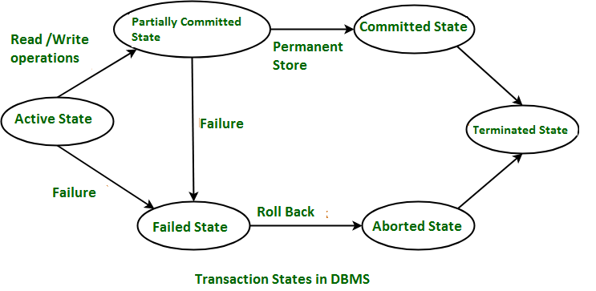

# Database

- RDBMS vs NoSQL에 대해서 설명해주세요.
    - RDBMS 정의
    - NoSQL 정의, 저장 방식에 따른 분류
- 데이터 베이스 성능의 중요 요소에 대해 설명해주세요.
- Index
    - Index란 무엇인가요?
    - 데이터베이스에서 인덱스를 사용하는 이유 및 장단점에 대해 설명해주세요.
    - Index 자료구조
    - Primary index vs Secondary index, Composite index
    - Index의 성능과 고려해야할 사항
- 트랜잭션
    - 트랜잭션에 대해서 설명해주세요.
    - 트랜잭션 격리 수준(Transaction Isolation Levels)에 대해서 설명해주세요.
    - ACID에 대해서 설명해주세요.
    - 특성, Lock, 상태, 주의할 점
    - cf) [DBMS는 어떻게 트랜잭션을 관리할까?](https://d2.naver.com/helloworld/407507)
- 정규화
    - 정규화에 대해서 설명해주세요.
    - 탄생 배경, 정의, 종류, 장단점
- JOIN에 대해서 설명해주세요.
- Statement vs PreparedStatement
- Redis에 대해서 간단히 설명해주세요.
- CAP 이론과, Eventual Consistency에 대해서 설명해주세요.
- Redis와 Memcached의 차이에 대해서 설명해주세요.
- Elastic Search에 대해서 간단히 설명해주세요.
    - Elastic Search의 인덱스 구조와 RDBMS의 인덱스 구조의 차이에 대해 설명해주세요.
    - Elastic Search의 키워드 검색과 RDBMS의 LIKE 검색의 차이에 대해 설명해주세요.
- MongoDB에 대해서 간단히 설명해주세요.

### RDBMS vs NoSQL

#### RDBMS (Relational Database Management System)

- DBMS : 응용 프로그램과 데이터 사이의 중재자로서 모든 응용 프로그램(사용자)들이 데이터베이스를 **공용할 수 있게 관리**해 주는 범용 소프트웨어 시스템
    - 논리적 데이터 독립성 : 응용 프로그램에 영향을 주지 않고 논리적 데이터 구조의 변경이 가능
    - 물리적 데이터 독립성 : 응용 프로그램과 논리적 데이터 구조에 영향을 주지 않고 물리적 데이타 구조의 변경이 가능
- RDBMS : 관계형 데이터베이스를 관리하는 DBMS
    - 관계형 모델
        - 수학에서의 릴레이션(relation)과 집합(set) 이론에 기초, 일반 사용자는 테이블(table) 형태로 생각
        - 데이터가 하나 이상의 열과 행의 테이블(또는 '관계')에 저장되어 서로 다른 데이터 구조가 어떻게 관련되어 있는지 쉽게 파악하고 이해할 수 있도록 사전 정의된 관계

#### NoSQL (Not only SQL)

- NoSQL : 관계형 모델이 아닌 데이터베이스를 관리하는 DBMS
- NoSQL의 종류
    - Key-Value Model : key-value pair로 데이터를 저장함, key는 unique identifier로도 사용됨 ex) Redis, DynamoDB
    - Document Model : JSON, XML 등 자유로운 형태로 데이터를 저장함 ex) MongoDB
    - Graph Model : 데이터를 graph의 형태로 저장, 각 항목이 node로 이루어져있고 node간의 관계는 edge를 사용해서 나타냄 ex) Neo4J, OrientDB

#### RDBMS vs NoSQL

| 구분             | RDBMS (관계형 DB)                                                      | NoSQL (비관계형 DB)                                                                |
|----------------|---------------------------------------------------------------------|--------------------------------------------------------------------------------|
| Data Modeling  | - 스키마에 맞춰서 관리하기 때문에 데이터 **정합성 보장**   - 관계를 맺고있는 데이터가 자주 변경되는 경우 | - 자유롭게 데이터를 관리할 수 있다   - 데이터 구조를 정확히 알 수 없는 경우   - 데이터가 변경/확장될 수 있는 경우 |
| Scalability    | Scale Up   각 단일 서버의 성능을 증가시켜서 더 많은 요청을 처리 (한계가 존재함)             | Scale Out   요청량이 증가하더라도 동일하거나 비슷한 사양의 새로운 하드웨어를 추가                         |
| Query Language | SQL(Structured Query Language)                                      | DB마다 문법이 다름                                                                    |
| Consistency    | STRONG                                                              | eventual consistency   - may take time to be consistent                    |
| flexibility    | 상대적으로 떨어짐                                                           | 매우 유연함                                                                         |

### 데이터베이스 성능 중요 요소

- 데이터베이스의 성능 향상의 초점은 디스크 (랜덤) 접근 횟수(I/O)의 최소화 
    - **인덱스 최적화**와 **SQL 최적화**의 우선순위가 높다.
- 인덱스 최적화
    - 인덱스를 통해 정렬되어 있는 자료에서 찾으므로써 디스크 접근 횟수를 줄일 수 있다.
    - 하단의 인덱스 부분 참고
- 질의어 최적화 과정
    - 질의문의 내부 표현 : 질의문 내부 표현 형태는 보통 트리 구조로 표현 가능
    - 효율적인 내부 형태로 변환 : 질의문 내부 표현을 동등하면서도 처리에 효율적인 형태로 변환시킨다
        - 연산 비용이 큰 Join 전에 데이터의 크기를 줄이는 연산을 먼저 함으로써 Join 연산을 최소한의 데이터로 진행한다.
    - 후보 프로시저 선정 : 주어진 내부 표현을 일련의 저급 연산(조인 프로시저, 셀렉트 프로시저) 등으로 명세하는 것
    - 질의문 계획의 평가 및 결정 : 주로 **디스크 입출력의 횟수**를 바탕으로 통계적으로 계산한 비용식을 바탕으로, 최소 비용의 계획을 결정

### 인덱스 (Index)

#### 인덱스란?
- 인덱스 파일은 '키 값'과 '데이터 주소'의 쌍으로 구성되어 있다
- 순차 접근(sequential access) 과 직접 접근(direct access) 을 지원한다
- 순차 데이터 화일
    - 레코드를 순차적으로 정렬 -> 레코드 집합 전체에 대한 순차 접근 요구를 지원하는데 사용
- 인덱스
    - 레코드들에 대한 포인터를 통해, 개별 레코드들에 대한 직접 접근을 지원하는데 사용

#### 인덱스 장단점
- 장점
    - 정렬된 데이터에서 조회하기 때문에 조회 성능이 더 좋아짐 (단일 조회 시 O(N) -> O(logN))
- 단점
    - 하나의 자료 구조를 가지고 있어야 하기 때문에 용량이 늘어난다
    - 읽기에서는 효율이 올라가지만, 수정/삭제에서는 더 많은 과정을 거쳐야 한다

#### 인덱스의 자료 구조
- B 트리 : 다진검색트리가 균형을 유지하도록 하여 최악의 경우 디스크 접근 횟수를 줄인 것
  - 루트를 제외한 모든 노드의 가지는 키 값 제한이 존재한다
  - 모든 리프 노드는 같은 깊이를 가진다
- B+ 트리 : 인덱스 세트와 순차 세트로 구성
  - 인덱스 세트 : B 트리의 중간 노드와 유사하게 구성됨
  - 순차 세트 : 리프 노드로 구성되고 모든 키 값들을 저장, 순차적으로 연결되어 있다
  - B 트리보다 연속적인 검색에 유리하다.
- 주로 B+ 트리를 이용한다

#### Primary index vs Secondary index
- 기본 인덱스 (Primary index)
    - 기본 키(primary key)를 포함한 인덱스
    - 하나의 레코드만 식별한다
- 보조 인덱스 (Secondary index)
    - 보통 보조 키(secondary key)를 포함, 이외 다른 컬럼(열)을 사용해도 된다
    - 여러 개의 레코드를 식별한다

#### Composite index
- 복합 인덱스 (Composite index)
    - 여러 개의 컬럼(열)들을 조합하여 인덱스를 생성하는 것
    - 여러 조건을 통해 조회해야 하는 일이 많다면, 해당 인덱스를 사용하여 더 빠르게 필요한 레코드를 검색할 수 있게 된다.
- 복합 인덱스 사용 시 주의점
    - 인덱스를 생성하는 컬럼의 개수가 많아질수록 인덱스의 성능은 떨어질 수 있다
    - 복합 인덱스를 생성할 때는 인덱스 생성 순서도 고려해야 한다
        - ex) [성별, 이름] 순서이면 성별을 우선 고려하고, 성별이 같은 경우 이름으로 고려한다

#### 인덱스 사용 시 고려해야 할 사항
- 인덱스에도 비용이 발생한다
    - 내용 수정/삭제 시에 인덱스로 수정/삭제되어야 한다
    - 쿼리에 있는 필드에 무작정 다 설정하는 것은 답이 아니다
    - 컬렉션에 가져와야 하는 양이 많을수록 인덱스를 사용하는 것은 비효율적이다
- 항상 테스팅해라
    - `EXPLAIN`을 통해서 테스팅을 해서 기존의 걸리는 시간과 비교해보아야 한다
    - 데이터의 분포도에 따라 효율적인 인덱스는 다를 수 있다
- 복합 인덱스는 '같음', '정렬', '다중 값', '카디널리티' 순으로 사용하는 것이 좋다

### 트랜젝션 

#### 트랜젝션 정의 & 특징 (ACID)
- 트렌젝션 (Transaction)
    - 작업의 논리적 기능을 수행하기 위한 작업의 단위

- 트랜젝션 특징 (ACID)
    - 원자성 (Atomicity) : 전부 또는 전무(All or Nothing)
    - 일관성 (Consistency) : 트랜잭션 실행 후에도 일관성(데이터 유효성) 유지
    - 격리성 (Isolation) : 트랜잭션 실행 중 연산의 중간 결과에 다른 트랜잭션이 접근할 수 없음
    - 영속성 (Durability) : 트랜잭션이 일단 성공적으로 실행되면 그 결과는 영속적

#### 트렌젝션 격리 수준 (Isolation Level)
- 격리 수준에 따라 발생할 수 있는 문제들
  - Dirty Read
    - 커밋이 되지 않은 데이터를 다른 트랜잭션이 읽을 수 있다.
    - 트랜잭션이 롤백되었을 경우 최종 결괏값이 비 일관적으로 적용될 가능성이 있다.
  - Non-Repeatable Read
    - 반복해서 같은 데이터를 읽을 수 없게 된다.
    - 한 트랜잭션 내 같은 쿼리를 두 번 수행할 때 그 사이에 다른 트랜잭션이 값을 수정/삭제하므로 두 쿼리의 결과가 상이하게 나타나는 비 일관성의 문제가 발생
  - Phantom Read
    - 반복 조회 시 결과 집합이 달라지는 문제
    - 한 트랜잭션 안에서 일정 범위의 레코드를 두 번 읽을 때, 처음 결과에 없던 레코드가 두 번째에서는 나타나는 문제

- 격리 수준 종류
  - Read Uncommitted
    - 다른 트랜잭션의 변경 내용이 commit이나 rollback 여부에 상관 없이 보임
  - Read Committed
    - 트랜젝션이 완료된 데이터만 다른 트랜잭션에서 조회 가능
    - 커밋되기 전에는 Undo Log에 있는 곳의 데이터를 읽어옴
  - Repetable Read (InnoDB 기본 값)
    - 언두 영역에 백업된 이전 데이터를 이용해서 동일 트랜잭션에서는 같은 내용을 보여줄 수 있도록 함
    - 다른 트랜젝션에서 커밋이 끝나 디스크 영역에 정보 값이 이미 바뀌었어도, 바뀌기 전의 값의 데이터를 전달함
  - Serializable
    - 하나의 트랜잭션에서 락을 가지고 있는 레코드에 다른 트랜잭션이 접근할 수 없음
    - LOCK을 획득해야만 정보를 조회,변경,추가 할 수 있다.
    - 비효율적이므로 실제로 사용하는 경우는 드물다.
    - InnoDB에서는 필요없음

- 격리 수준에 따른 발생 가능한 문제들

  | 구분               | DIRTY READ | NON REPEATABLE READ | PHANTOM READ |
  |------------------|------------|---------------------|--------------|
  | Read Uncommitted | 발생 가능      | 발생 가능               | 발생 가능        |
  | Read Committed   |            | 발생 가능               | 발생 가능        |
  | Repetable Read   |            |                     | 발생 가능        |
  | Serializable     |            |                     |              |

#### 트렌젝션 상태

- Active State (활동 상태)
  - Transaction이 진행중인 상태
  - 읽기 또는 쓰기가 정상적으로 진행된 경우, “Partially Committed State”
  - 읽기 또는 쓰기가 실패한 경우, “Failed State”
- Partially Committed State (부분 완료 상태)
  - 모든 읽기 쓰기 데이터가 DB에 저장된 경우 “committed state”로 이동
  - DB에 저장이 실패한 경우, “Failed State”
- Failed State (실패 상태)
  - Transaction의 명령이 실패하거나 DB에 데이터 저장, 변경에 실패한 경우
- Aborted State (철회 상태)
  - local buffer 또는 main memory에 있는 변경 사항들을 지우거나 롤백함
- Committed State (완료 상태)
  - DB에 모든 내용이 저장된 상태
- Terminated State
  - 롤백이나 다른 커밋 상태가 없을 때
  - 이전에 있었던 transaction은 지우고 새로운 transaction에 대기하는 상태

#### Lock
- 잠금이 된 데이타 집합을 생성
  - 잠금이 된 데이터는 다른 트랜젝션에서 사용할 수 없으며, 잠근 트랜젝션에서만 풀 수 있다
- 공용 락 (lock-S, Shared), 독점 락 (lock-X, exclusive)이 있으며, 공용 락에서는 읽기만 전용 락에서는 읽기, 쓰기 연산이 모두 가능
  - 공용 락들은 서로 양립할(같은 데이터에 접근할) 수 있지만, 이외의 경우는 다른 트랜젝션은 대기하여야 한다
- 문제점 : **교착 상태**가 발생 할 수 있다.
  - 교착 상태의 필요충분조건 : 상호 배제, 대기, 선취 금지, 순환 대기
  - 해결책 : 탐지 (교착 발생 조건의 하나를 제거), 회피 (실시간 알고리즘 검사), 예방 (적당량 이상의 자원 분배)

- 여러 locking 규약 들
  - 2PLP (2단계 로킹 규약)
    - 확장 단계(lock만 가능)와 축소 단계(unlock만 가능)로 구성
    - 특정 경우에서 연쇄 복귀 문제(Cascading Rollback)가 발생할 수 있다
  - strict 2PLP
    - 모든 독점 락(lock-X)는 그 트랜젝션이 완료할 때까지 unlock하지 않아야 한다
    - 완료하지 않은 어떤 트랜잭션에 의해 기록된 모든 데이타는 그 트랜잭션이 완료할 때까지 독점 모드로 로킹
    - 연쇄 복귀 문제가 일어나지 않는다
  - rigorous 2PLP
    - 모든 락(lock-X, lock-S)는 그 트랜젝션이 완료할 때까지 unlock하지 않아야 한다
  - 대부분의 상용 DBMS에서는 strict 2PLP나 rigorous 2PLP를 사용한다

#### 주의할 점
- 트랜잭션은 꼭 필요한 최소한의 코드에만 적용하는 것이 좋다. 즉, 트랜잭션의 범위를 최소화하라는 말이다.

### 정규화
- 정의, 탄생 배경

#### 정규화 종류
- 제 1,2,3 정규화

#### 정규화 장단점

### JOIN

### CAP 이론

### Redis