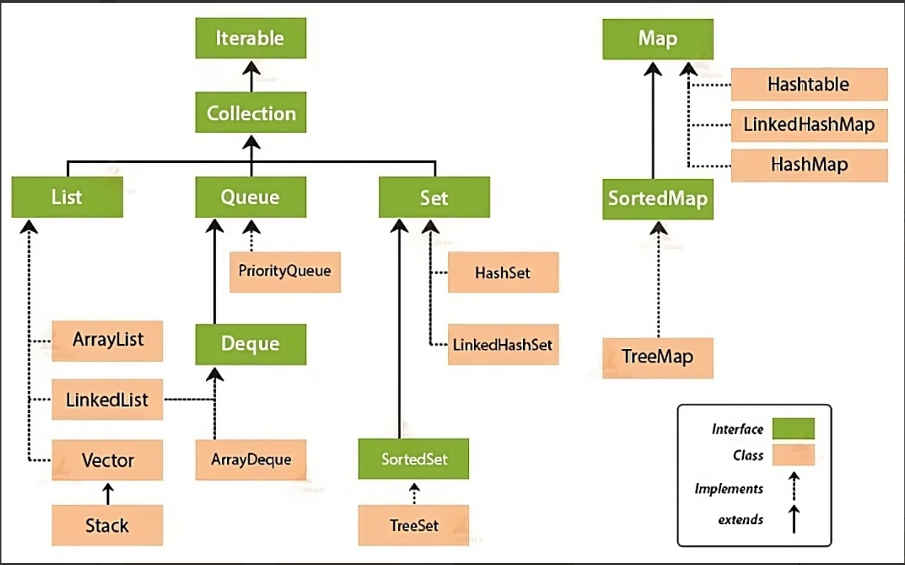

# Java

- Java 기본 구조
  - JDK와 JRE의 차이점을 설명하세요.
  - JVM의 구조와 Java의 실행방식을 설명해주세요.
  - GC가 무엇인지, 필요한 이유는 무엇인지, 동작방식에 대해 설명해주세요.
  - 스크립트 언어와 컴파일 언어를 나열하고 차이점을 설명해주세요.

- Java 타입
  - 원시타입과 참조타입의 차이에 대해 설명해주세요.
  - 자바의 원시타입들은 무엇이 있으며 각각 몇 바이트를 차지하나요?

- 클래스
  - 인터페이스와 추상 클래스의 차이점에 대해 설명해주세요.
  - 오버라이딩과 오버로딩이 무엇이며 어떤 차이가 있을까요?
  - 정적(static)이란 무엇인가요?
  - 제네릭에 대해서 설명해주세요.
  - Mutable 객체와 Immutable 객체의 차이점에 대해 설명해주세요.

- Java 라이브러리
  - String, StringBuilder, StringBuffer 각각의 차이에 대해 설명해주세요.
  - 컬렉션 프레임워크에 대해서 설명해주세요.
  - 자바에서 null을 안전하게 다루는 방법에 대해 설명해주세요. (Optional)
  - Java8에서 추가된 기능에 대해서 설명해주세요.

- 멀티스레드, 역직렬화
  - Multi-Thread 환경에서의 개발
  - 자바의 동시성 이슈(공유자원 접근)에 대해 설명해주세요.
  - 직렬화와 역직렬화에 대해서 설명해주세요.

- 기타
  - 애노테이션에 대해서 설명해주세요.
  - 동일성(identity)와 동등성(equality)에 대해 설명해주세요. (equals(), ==)
  - Checked Exception과 Unchecked Exception에 대해 설명해주세요.
  - try-with-resource에 대해서 설명해주세요.
  - 강한 결합과 느슨한 결합이 무엇인지 설명해주세요.

- 객체 지향
  - 객체 지향 프로그래밍이란?
  - 객체 지향 프로그래밍의 장점
  - 객체 vs 클래스
  - 객체 지향 특징
  - 객체 지향 5가지 원칙 (SOLID 원칙)

### Java 기본

- [JVM](./java_virtual_machine.md)
  - JVM, JRE, JDK
  - Java 실생 방식, JVM 구조
  - 런타임 영역 구조, GC
- [Java 타입](./java_type.md)
  - 원시 타입 vs 참조 타입
  - Constant String Pool

### 클래스

#### 오버라이딩 vs 오버로딩

- 매서드 오버라이딩
  - 상위 클래스에서 상속받은 메서드와 동일한 이름의 메서드를 재정의하는 것 
  - 기능을 하위 클래스에 맞추어 다시 메서드를 설정함
- 매서드 오버로딩 
  - 같은 클래스 내에서 매서드의 이름이 같으면서 매개변수의 타입 or 개수가 다른 경우

#### 인터페이스 vs 추상 클래스

- 추상 클래스 (abstract class) 
  - 추상 메서드를 하나 이상 포함한 매서드
  - 추상 클래스 만으로 객체 생성 불가
- 인터페이스 (interface)
  - 오직 추상 메서드와 상수만을 멤버로 가질 수 있다. (추상도가 추상 클래스보다 높음)
  - 모든 필드가 public static final 로 선언됨
  - static과 default 메서드 이외의 모든 메서드가 `public abstract`로 정의된다

#### Static

- static 변수
  - 클래스 로더가 클래스를 로딩해서 메소드 메모리 영역에 적재할때 클래스별로 관리
  - Garbage Collector가 관여하지 않음 (Heap 영역이 아닌 Static(Method) 영역에 할당됨)
  - 모든 객체가 메모리를 공유

- static 메서드
  - 클래스가 메모리에 올라갈 때 정적 메소드가 자동적으로 생성
  - 인스턴스를 생성하지 않아도 호출을 할 수 있다
  - 유틸리티 함수를 만드는데 유용하게 사용한다

- static을 지양해야 하는 이유
  - 객체와 다른 라이프사이클 : 클래스를 이용한 작업을 끝내더라도 static 변수가 점유하고 있는 메모리는 GC에 의해 회수되지 않음
  - 동시성 이슈 문제 : static 변수에 있는 객체가 변경이 가능하다면, 멀티 스레드 환경에서 동시성 문제가 발생할 수 있다
  - 객체의 상태 이용 불가 : static은 프로그램 시점에 메모리에 올라가는데, 정적 메소드 안에 객체의 인스턴스 필드가 초기화되지 않았다면 문제가 생길 수 있다. 그래서 정적 메소드 안에는 정적 변수만 사용할 수 있다.
  - static 메서드는 오버라이딩 불가
  - (단위) 테스트 어려움

#### Generic

- 제너릭 
  - 클래스에서 다룰 객체를 미리(객체 생성시에) 명시해줌으로써 형 변환을 하지 않고 사용하는 것
  - 내부 코드는 동일한지만 다른 타입의 필드, 메서드, 클래스들이 필요하다면, 이를 하나하나 전부 만드는 것은 비효율적이다.
    - 최상위 클래스인 Object를 이용한다면, 다형성으로 인해 쉽게 다룰 수 있을 것이다. 그러나 매번 수동 형변환을 해주어야 해서 일부 비효율적이다.

- 장점
  - 타입체크와 형변환을 생략해서 간결한 코드 작성이 가능
  - 클래스나 메서드 내부에서 사용되는 객체의 타입 안정성을 제공

- 기타
  - 제너릭 메서드
    - 제네릭 타입을 선언한 메소드
    - 호출되는 시점에서 실제 제네릭 타입을 지정
    - 해당 메서드 안에서만 사용할 수 있는 지역 변수처럼 사용
  - 와일드 카드
    - 물음표 ?로 표시하며 Java에서 unknown type이다
    - 와일드카드는 매개변수, 필드 또는 지역 변수의 유형 때론 반환 유형으로 다양한 상황에서 사용할 수 있다
  - 정해진 타입이 의미 있게 사용되는 경우에는 '제너릭 메서드', 의미 있지 않은 경우에는 '와일드카드'를 추천

```java
interface Example {
    <T> List<T> makeList(T element);
    void print(List<?> elements);
}
```

#### 불변 객체 vs 가변 객체

### Java 라이브러리

#### String 만들기

- StringBuffer vs StringBuilder
  - 공통점 : String과 달리, 둘 다 크기가 유연하게 변하는 가변성을 갖는다. (`append()`)
    - 변하지 않는 문자열을 자주 사용할 경우 String 타입을 사용하는 것이 좋다
  - 차이점 : StringBuilder는 동기화를 지원하지 않는 반면, StringBuffer는 동기화를 지원한다
    - StringBuffer는 `synchronized`를 사용하므로 멀티 스레드 환경에서도 안전하게 동작할 수 있습니다.
    - StringBuilder는 `synchronized`를 사용하지 않으모로 단일 스르드 환경에서는 StringBuffer보다 더 빠르게 동작할 수 있다

- String Constant Pool
  - String 을 리터럴 값으로 할당하는 경우엔 Heap 메모리 영역안의 특별한 메모리 공간인 String constant pool 에 저장한다
  - String constant pool에 존재하는 리터럴 값을 사용하게 된다면, 현재 존재하는 값을 사용한다
  - new 키워드를 통해 String 변수에 값을 할당하게 되면 일반적인 객체와 동일하게 Heap 영역에 동적으로 메모리 공간이 할당된다
    - 이와 같은 방법은 메모리가 낭비되므로, 리터럴 방법으로 할당하는 것이 좋다

#### 컬렉션 프레임워크

<center></center>

- Java Collection Framework
  - 데이터를 저장하는 자료 구조와 데이터를 처리하는 알고리즘을 구조화하여 클래스로 구현해 놓은 것
- 컬렉션 프레임워크의 장점
  - 인터페이스와 다형성을 이용한 객체지향적 설계를 통해 **표준화**되어 있기 때문에, 사용법을 익히기에도 편리하고 재사용성이 높다.
  - 데이터 구조 및 알고리즘의 고성능 구현을 제공하여 프로그램의 성능과 품질을 향상시킨다.
  - 관련 없는 API 간의 상호 운용성을 제공한다. (ex. `List`, `Map`, ...)
  - 이미 구현되어있는 API를 사용하면 되기에, 새로운 API를 익히고 설계하는 시간이 줄어든다.
- Iterator
  - (Map을 제외한) 컬렉션 인터페이스들의 가장 최상위 인터페이스
  - Iterator 하위 클래스들은 모두 향상된 for문을 사용할 수 있다

#### Java 8 추가 기능
- Lamda 표현식, Funtional Interface
  - Lamda 표현식 : 익명 클래스를 사용하면 가독성이 떨어지는데, 이를 보완함
  - FuntionalInterface : 함수가 하나만 있는 인터페이스
    - 람다식 하나만을 이용하여, 클래스를 만들 수 있다.
    - 표준 API 제공 (`Runnable`, `Consumer`, ...)
    - 동작을 손쉽게 파라미터화할 수 있게 되었다
- Stream API
  - 다양한 연산을 쉽게 제공함
  - 게으른 형식의 연산으로 구성, 멀티 코어 CPU를 활용한 병렬 처리
- Optional
  - `T` 형식을 반환하거나 값이 없음을 의미
  - `NullPointerException` 방지, 다양한 API 제공
- 날짜 관련 클래스
  - 기존 문제점 : `Date` - 밀리초 단위로 표현해서 직관적이지 않음, `Calendar` - 쉽게 에러를 일으킴, 둘 다 가변 객체
  - `LocalDate`, `LocalTime`, `DateTimeFormatter`, `ZoneId` 등을 통해 날짜 시간 연산등을 쉽게할 수 있다
- 디폴드 메서드 : interface에 기본 구현 제공 가능
  - 새로 추가된 기능을 하나하나 구현하지 않아도 된다.
  - 인터페이스가 바뀌어도 사용자는 신경 쓸 필요 없다.
- StringJoiner
  - 여러 문자 사이나 앞뒤에 delimiter, prefix, suffix를 추가하여 문자를 합필 수 있다 

#### Optional

- `null` 때문에 발생하는 문제
  - 에러의 근원 : `NullPointerException`은 자바에서 흔히 발생하는 에러이다
  - 코드를 어지럽힌다 : 중첩된 null 체크
  - 아무 의미가 없다
  - 자바 철학에 위배된다 : 자바는 개발자로부터 모든 포인터를 숨겼는데, null 포인터는 숨기지 못했다.
  - 형식 시스템에 구멍을 만든다 : null이 할당되기 시작하면서 다른 시스템으로 퍼졌을 때, 애초에 null이 어떤 의미로 사용되었는지 알 수 없다.

- Optional
  - 선택형 값을 캡슐화하는 클래스
  - null 처리를 용이하게 할 수 있는 메서드를 제공

### 객체 지향

- 컴퓨터 프로그램을 어떤 데이터를 입력받아 순서대로 처리하고 결과를 도출하는 명령어들의 목록으로 보는 시각에서 벗어나 **여러 독립적인 부품들의 조합, 즉 객체들의 유기적인 협력과 결합**으로 파악하고자 하는
  컴퓨터 프로그래밍의 패러다임

#### 객체 지향 프로그래밍의 장점

- 프로그램을 보다 **유연하고 변경이 용이**하게 만들 수 있다
- 각각의 부품들이 각자의 독립적인 역할을 가지기 때문에 **코드의 변경을 최소화하고 유지보수를 하는 데 유리**
- 코드의 재사용을 통해 **반복적인 코드를 최소화하고, 코드를 최대한 간결**하게 표현

#### 클래스 vs 객체

- 클래스 (Class)
  - 객체를 정의한 설계도, 틀
  - 객체를 생성하는데 사용한다
- 객체 (Object)
  - 클래스를 통해 만들어진 실제로 사용할 수 있는 실체
  - 인스턴스를 포괄하는 넓은 의미

#### 객체 지향 특징

- 추상화 : 서로 다른 여러 객체의 공통점을 묶어 추상 클래스나 인터페이스로 사용한다
  - 인터페이스나 추상 클래스를 구현한 객체를 만들 때, 특정 기능을 강제할 수 있다
- 캡슐화 : 서로 연관있는 속성과 기능들을 하나의 캡슐(capsule)로 만들어 데이터를 외부로부터 보호한다
  - 외부에 노출할 필요 없는 정보들은 바깥으로 노출할 필요 없다
- 상속 : 기존 클래스를 확장하여 새로운 클래스를 작성할 수 있다
  - 상위 클래스로부터 확장된 여러 개의 하위 클래스들이 모두 상위 클래스의 속성과 기능들을 간편하게 사용할 수 있다
- 다형성 : 어떤 객체의 속성이나 기능이 상황에 따라 여러 가지 형태를 가질 수 있는 성질
  - 상속관계에 있는 객체들은 상위 클래스 등으로 형변환이 가능하다

#### 객체 지향 5가지 원칙 (SOLID 원칙)

- SRP (단일 책임 원칙, Single Responsibility principle)
  - 한 클래스는 하나의 책임만 가져야 한다
  - e.g. '책임'이라는 말은 문맥과 상황에 따라 다를 수 있으므로, '변경'을 기준으로 생각하면 용이하다
- OCP (개방 폐쇄 원칙, Open/Close principle)
  - 소프트웨어 요소는 확장에는 열려 있으나, 변경에는 닫혀 있어야 한다
  - e.g. 다형성을 잘 이용한다면 OCP를 잘 지킬 수 있을 것이다
- LSP (리스코프 치환 원칙, Liskov substitution principle)
  - 프로그램의 객체는 프로그램의 정확성을 깨뜨리지 않으면서 하위 타입의 인스턴스로 바꿀 수 있어야 한다
- ISP (인터페이스 분리 원칙, Interface Segregation principle)
  - 특정 클라이언트를 위한 인터페이스 여러 개가 범용 인터페이스 하나보다 낫다
  - 한 인터페이스 변경에 다른 인터페이스가 영향을 받지 않는다
- DIP (의존관계 역전 원칙, Dependency inversion principle)
  - 구현 클래스에 의존하지 말고, 인터페이스에 의존해야 한다