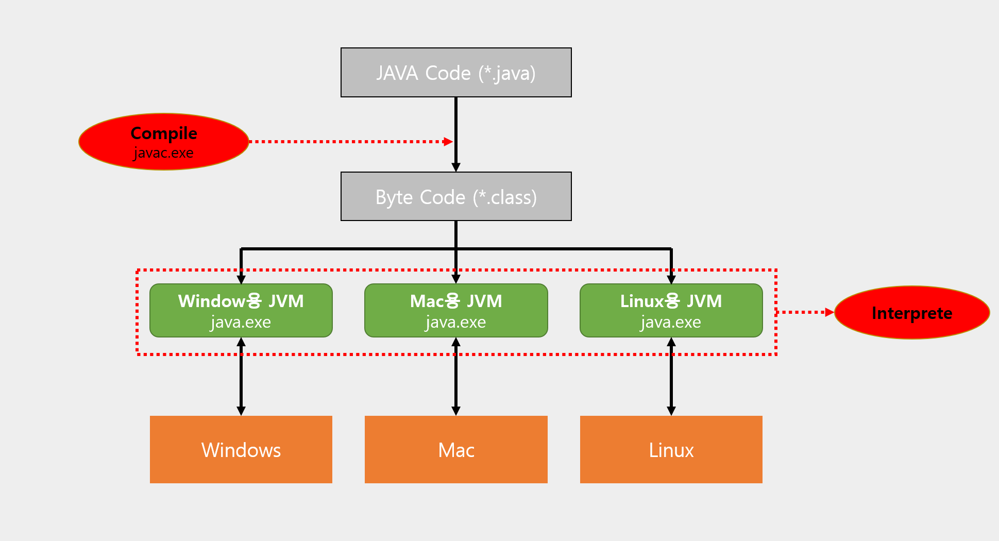
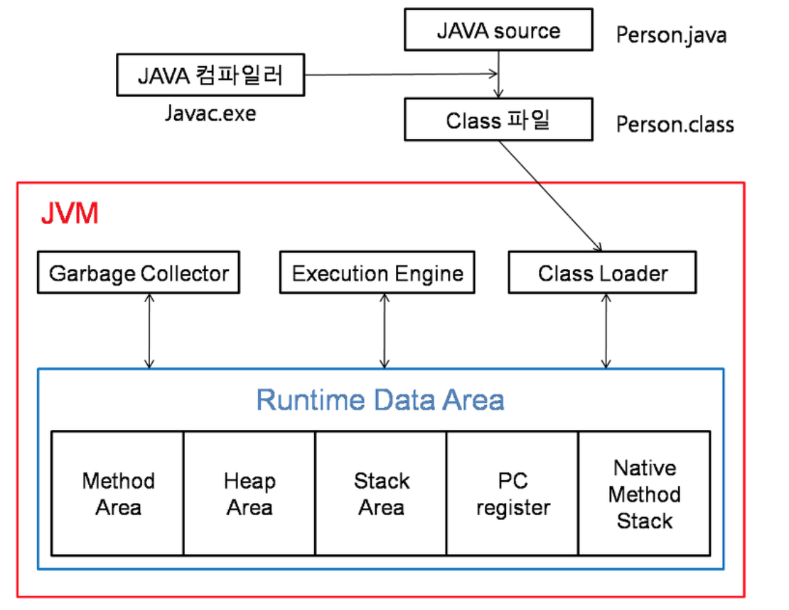

# JVM

### JVM, JRE, JDK

- JVM (Java Virtual Machine) : 바이트코드를 운영체제에 맞게 기계어로 변환해준다
  - 자바 프로그램이 어느 기기, 어느 운영체제 상에서도 실행될 수 있다
  - 자바 프로그램의 메모리를 효율적으로 관리 & 최적화 한다
- JRE (Java Runtime Environment) : JVM + 표준 자바 라이브러리, 클래스 로더
  - 클래스 로더, 클래스 라이브러리를 통해 작성한 자바 코드를 라이브러리와 결합한 후 JVM에 넘겨 실행시킨다
  - JVM이 원활하게 잘 작동할 수 있도록 환경을 맞춰주는 역할을 한다
- JDK (Java Development Toolkit) : JRE + 개발에 필요한 도구
  - 자바 컴파일러를 포함하고 있다 (java 파일을 class 파일로 변경)

#### Java 실행 방식

1. 자바 컴파일러를 통해 자바 클래스 파일(.java)를 자바 바이트코드(.class)로 변환한다
2. 클래스 로더를 통해 자바 바이트코드를 JVM 런타임 데이터 영역에 로드한다.
    - OS마다 JVM이 달리 있어, 같은 바이트 코드라고 여러 OS에서 동일하게 실행할 수 있다.
3. 실행 엔진을 통해 실행한다.

### JVM 구조

- JVM 구조
  - Class Loader : JVM 내로 class 파일들을 불러들인다. 로딩된 클래스들은 Runtime Area의 method 영역에 배치된다
  - Execution Engine : 로딩된 클래스의 바이트 코드를 해석한다. 이 과정에서 ByteCode가 BinaryCode로 변경된다
  - Garbage Collector : 프로그램에서 더 이상 사용하지 않는 객체를 찾아 삭제하거나 제거하여 메모리를 확보한다
  - Runtime Area : JVM이 프로세스로 수행되기 위해 OS로부터 할당받는 메모리 영역

### Runtime Area
  - Stack 영역
    - 메서드 호출 시마다 각각의 스택 프레임(해당 메서드만을 위한 공간)이 생성, 메서드 안에서 사용되는 값(매개변수, 지역변수 등)들을 저장
    - 스택 프레임이 스택에 호출되는 순서대로 쌓고, 메서드의 동작이 완료되면 역순으로 제거
  - Heap 영역
    - 참조형(Reference Type) 데이터 타입을 갖는 객체(인스턴스), 배열 등이 저장 되는 공간
    - Heap 영역에 있는 오브젝트들을 가리키는 레퍼런스 변수는 stack에 적재
    - Heap 영역은 Stack 영역과 다르게 보관되는 메모리가 호출이 끝나더라도 삭제되지 않고 유지된다. 그러다 어떤 참조 변수도 Heap 영역에 있는 인스턴스를 참조하지 않게 된다면, GC에 의해 메모리에서
      청소된다.
  - method 영역 (static 영역)
    - 클래스, 인터페이스, 메소드, 필드, Static 변수 등의 바이트 코드를 보관
    - method 영역의 데이터는 프로그램의 시작부터 종료가 될 때까지 메모리에 남아있다
    - static 데이터를 무분별하게 많이 사용할 경우 메모리 부족 현상이 일어날수 있게 된다
  - PC Register : 쓰레드가 어떤 부분을 무슨 명령으로 실행해야할 지에 대한 기록을 하는 부분
  - Native method Stack : 자바 외 언어로 작성된 네이티브 코드를 위한 메모리 영역
  - Runtime constant pool
    - String을 리터럴로 선언할 때 해당 객체를 저장
    - 같은 것을 리터럴로 만들면, 같은 주소를 가르킴

### GC (Garbage Collector)

- Garbage Collector
  - 프로그램에서 더이상 사용하지 않는 객체를 찾아 삭제하거나 제거하여 메모리를 확보한다
  - 아무한테도 참조되고 있지 않은 객체 및 변수들을 검색하여 메모리에서 점유를 해제하여 메모리 공간을 확보함으로써 효율적으로 메모리를 사용할 수 있게 해준다

- GC의 종류
  - Minor GC : Heap 영역의 Young 영역에서 활동하는 가비지 컬렉터
    - Young 영역 : 새롭게 생성된 객체가 할당되는 곳, 많은 객체가 생성되었다 사라지는 것을 반복한다
  - Major GC : Heap 영역의 Old 영역에서 활동하는 가비지 컬렉터
    - Old 영역 : Young 영역에서 상태를 유지하고 살아남은 객체들이 복사되는 곳, Young 영역보다 크게 할당되고 가비지는 적게 발생한다

- GC의 실행 방식
  - Step 1. Stop The World
    - 가비지 컬렉션을 실행시키기 위해 JVM이 애플리케이션의 실행을 멈추는 작업
    - GC 실행시, 가비지 컬렉션을 실행하는 쓰레드를 제외한 모든 쓰레드들의 작업은 중단되고, 가비지 정리가 완료되면 재개한다
  - Step 2. Mark and Sweep
    - Mark : 사용되는 메모리와 사용하지 않는 메모리를 식별하는 작업
    - Sweep : Mark단계에서 사용되지 않음으로 식별된 메모리를 해제하는 작업
  - Young 영역과 Old 영역은 서로 다른 메모리 구조로 되어 있기 때문에, 세부적인 동작 방식은 다르지만 기본적인 내용은 동일하다