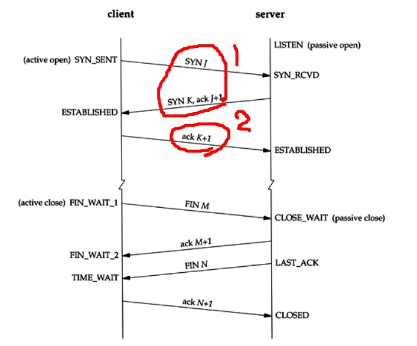

# 네트워크

- TCP vs UDP
  - TCP와 UDP의 차이점에 대해서 설명해보세요.
  - TCP 3, 4 way handshake에 대해서 설명해보세요.
  - OSI 7계층과 그 존재 이유, TCP/IP 4계층에 대해 설명해보세요.
    - 웹 서버 소프트웨어(Apache, Nginx)는 OSI 7계층 중 어디서 작동하는지 설명해보세요.
    - 웹 서버 소프트웨어(Apache, Nginx)의 서버 간 라우팅 기능은 OSI 7계층 중 어디서 작동하는지 설명해보세요.

- HTTP
  - HTTP의 문제점
  - 무상태성과 비연결성에 대해서 설명해주세요.
  - HTTP와 HTTPS의 차이점에 대해서 설명해보세요.
  - HTTPS에 대해서 설명하고 SSL Handshake에 대해서 설명해보세요.
  - SSL 인증서 암호화 기법인 대칭키 암호화 기법, 공개키 암호화 기법에 대해 설명해주세요.
  - Expires, Date, Age, If-Modified-Since의 차이점에 대해 설명해주세요.
  - If-Modified-Since와 If-None-Match의 차이점에 대해 설명해주세요.

- REST API
  - RESTful이란 무엇이며, 이것에 대해서 아는대로 설명해보세요.
  - HTTP 메서드와 이것이 하는 역할에 대해서 설명해보세요.
  - GET과 POST의 차이점에 대해서 설명해보세요.
  - PUT과 PATCH의 차이점에 대해서 설명해보세요.

- 기타
  - CORS(Cross-Origin Resource Sharing)는 무엇인가 왜 이러한 방법이 정의 되었으며, 본인이 코드를 작성하면서 CORS와 관련하여서 경험하였던 이슈는 무엇인가요?
    - same-origin 정책에 대해 설명해주세요.
  - 웹 통신의 큰 흐름: https://www.google.com/ 을 접속할 때 일어나는 일 (DNS round robin 방식)
  - OAuth에 대해서 간단히 설명해주세요.
  - 브라우저 저장소에 대해서 설명해주세요.
    - Session과 Cookie 그리고 Token의 차이에 대해 설명해주세요.
  - 프록시 서버가 필요한 이유

### TCP vs UDP

- 공통점 : OSI 7 Layer 중 전송 계층에서 사용되는 프로토콜

- TCP (Transmission Control Protocol)
  - 연결 위주 전송 방식 (Connection-Oriented)
  - 신뢰성을 보장하며 3-way handshaking 과정을 통해 연결
  - TCP 연결경로를 통하여 데이터를 전송하고 이에 대한 응답(ack)을 받음으로 써 그 데이터가 올바르게 전송되었음을 보장
  - 양방향 연결 (가상회선 연결방식)
  - ex)

- UDP (User Datagram Protocol)
  - datagram 기반의 전송 프로토콜
  - 비연결형 데이터 전송, 비신뢰성 프로토콜 (데이터가 목적 호스트에 도착한다는 보장을 하지 못한다)
  - TCP보다 속도가 빠르다
  - ex) 실시간 스트리밍 서비스

#### TCP handshaking

- TCP 3-way handshaking (서버와 클라이언트를 논리적으로 연결하는 과정)
  1. [클라이언트 -> 서버]
     랜덤으로 Sequence number(J)를 만들고, 자신의 `SYN(J)`를 서버에 보낸다
  2. [서버 -> 클라이언트]
     서버는 `SYN(J)`를 받고, 랜덤으로 Sequence number(K)를 만든다
     `SYN(J)`를 잘 받았다는 의미인 `ACK(J+1)`과 서버가 만든 `SYN(K)`를 클라이언트에게 보낸다
  3. [클라이언트 -> 서버]
     클라이언트는 `SYN(K)`를 잘 받았다는 의미로 `ACK(K+1)`을 서버로 보낸다

- TCP 4-way handshaking (클라이언트가 서버에 연결을 끊는 과정)
  1. [클라이언트 -> 서버]
     클라이언트는 내부적으로 `close()`를 호출하여 서버에게 연결을 종료한다는 `FIN(M)` 플래그를 보낸다
     (FIN 패킷 내에는 실질적으로 ACK도 포함되어 있다)
  2. [서버 -> 클라이언트]
     서버는 `FIN(M)`을 받고, 확인했다는 `ACK(M+1)`를 클라이언트에게 보내고 자신의 통신이 끝날때까지 기다린다 (TIME_WAIT 상태)
     아직 남은 데이터가 있다면 마저 전송을 마친 후에 내부적으로 `close()`를 호출한다
  3. [서버 -> 클라이언트]
     데이터를 모두 보냈다면, 서버는 연결이 종료에 합의 한다는 의미로 `FIN(N)` 패킷을 클라이언트에게 보낸다
     클라이언트가 신호를 보내줄 때까지 기다니는 LAST_ACK 상태로 들어간다
  4. [클라이언트 -> 서버]
     클라이언트는 `FIN(N)`을 받고, 확인했다는 `ACK(N+1)`를 서버에게 보낸다
     서버는 ACK를 받은 이후 소켓을 닫는다

### HTTP

#### HTTP

- HTTP
  - HyperText Transfer Protocol
  - 텍스트 기반의 통신 규약으로 인터넷에서 데이터를 주고받을 수 있는 프로토콜(규약, 형식)
  - Request, Response의 구조는 동일하며 Start Line에 담고 있는 정보만 다르다
    - HTTP 구조 : Start Line (Status Line) / Headers / Body
    - HTTP Request : Start Line에 HTTP Method와 URI 정보가 담겨있다
    - HTTP Response : Status Line에 Status code, Status text가 담겨 있다 

- 특징
  - 클라이언트 - 서버 구조
    - 클라이언트는 서버에 요청을 보내고, 응답을 대기한다.
    - 서버는 요청에 대한 결과를 만들어 응답한다.
  - 무상태성
    - 서버가 클라이언트의 상태를 보존하지 않는다
    - 서버의 확장성(Scale out)이 높아지는 장점이 있지만, 클라이언트가 추가 데이터를 전송해야 한다
  - 비연결성
    - 서버와 클라이언트가 기본적으로 연결을 유지하지 않는다
    - 여러 사람이 사용하더라도, 요청 하나의 처리 시간은 초 단위 이하이다
    - 서버 자원을 매우 효율적으로 활용할 수 있게 된다

- HTTP의 문제점
  - 평문 통신이기에 도청이 가능하다. (암호화 필요)
  - 완전성을 증명할 수 없기 떄문에 변조가 가능하다. (암호화 필요)
  - 통신 상대를 확인하지 않기 때문에 위장이 가능하다. (인가, 인증 필요)
  - 통신하고 있는 상대방이 허가된 상대인지 확인할 수 없다. (인가, 인증 필요)
  - 의미없는 리퀘스트도 수신하기 때문에 DoS 공격을 당할 수 있다.
  

#### HTTPS

- HTTPS에 대해서 설명하고 SSL Handshake에 대해서 설명해보세요.
- SSL 인증서 암호화 기법인 대칭키 암호화 기법, 공개키 암호화 기법에 대해 설명해주세요.

- HTTP vs HTTPS

#### 캐시 처리를 위한 HTTP Headers

- 캐시 유효 기간 설정
  - Cache-Control: max-age
    - 문서가 처음 생성된 이후부터, 제공하기엔 더 이상 유효하지 않다고 간주될 때까지 경과한 시간을 지정
    - ex) Cache-Control: max-age=484200 (484,200초 동안 유효함) 
  - Expires
    - 문서가 유효한 절대 유효시간을 명시
    - ex) Expires: Fri, 05 Jul 2002, 05:00:00 GMT (해당 날짜 이전까지만 유효함)

- 서버 재검사 
  - 캐시 유효기간이 지났을 때, 클라이언트는 서버에게 정보를 다시 요청한다
  - 응답이 기존과 다를 경우 응답 데이터를 보내지만, 동일할 경우 '304 Not Modified'를 Status line에 담아 응답한다
  - **If-Modified-Since** (IMS 요청)
    - 서버에게 리소스가 특정 날따 이후로 변경에 따른 조건부 요청
    - 가장 흔히 사용되는 캐시 재검사 헤더이다
    - ex) `If-Modified-Since : Fri, 05 Jul 2002, 05:00:00 GMT`
  - **If-None-Match**
    - 요청한 엔터티의 태그 변경에 따른 조건부 요청
    - ex) `If-None-Match : "v2.4", "v2.5", "v2.6"`

- Expires, Date, Age, If-Modified-Since의 차이점
  - **Expires** : 응답이 더 이상 유효하지 않게 되는 일시를 알려준다
    - ex) `Expires: Fri, 05 Jul 2002, 05:00:00 GMT`
  - **Date** : 메시지가 생성된 날짜와 시간을 알려준다
    - ex) `Date: Fri, 05 Jul 2002, 05:00:00 GMT`
  - **Age** : 수신자에게 응답이 얼마나 오래되었는지 말해준다
    - ex) `Age : 60 (초 단위)`
  - **If-Modified-Since** : 마지막으로 요청이 있었을 때를 기준으로, 변경이 있었을 때만 응답을 받음 (조건부 요청)
    - 변경이 없었을 경우, '304 Not Modified'로 응답한다
    - ex) `If-Modified-Since : Fri, 05 Jul 2002, 05:00:00 GMT`

### REST API

- REST (Representational State Transfer API)
  - HTTP URI(Uniform Resource Identifier)를 통해 자원(Resource)을 명시한다
  - HTTP Method를 통해 해당 자원(URI)에 대한 CRUD 기능을 적용한다.

- [REST의 특징](https://aws.amazon.com/ko/what-is/restful-api/)
  - Server-Client(서버-클라이언트 구조)
  - Stateless(무상태)
  - Cacheable(캐시 처리 가능)
  - Layered System(계층화)
  - Uniform Interface(인터페이스 일관성)

- REST API : REST 아키텍처의 제약 조건을 준수하는 애플리케이션 프로그래밍 인터페이스

#### HTTP Method

- HTTP Method
  - 해당 자원(URI)에 대한 CRUD 기능을 의미한다
  - Method를 분리하는 이유 : 리소스(URI)와 동작(Method)을 분리하기 위해

- 종류
  - GET : 해당 자원을 조회
  - POST : 해당 자원을 등록(추가)
  - PUT : 리소스를 완전히 대체 (해당 리소스가 없다면, 새롭게 생성)
  - PATCH : 리소스를 부분적으로 변경함
  - DELETE : 해당 자원을 삭제
  - 이외, HEAD, OPTIONS, CONNECT 등이 있다

- GET vs POST
  - GET
    - 리소스를 조회하는 메서드
    - 서버에게 데이터를 전달하는 경우, 쿼리 스트링을 통해 전달함
    - 성공적으로 조회시, 200 OK 응답를 받음
    - ex) `GET /members?sort=age`
  - POST
    - 새로운 리소스를 생성하는데 사용
    - 서버에게 데이터를 전달할 때, Body에 정보를 담아 전송한다
    - 성공적으로 생성시, 201 CREATED 응답을 받음

- PUT vs PATCH
  - PUT
    - 리소스를 완전히 덮어 씌운다
    - 멱등성을 지닌다
  - PATCH
    - 리소스를 부분 변경하는데 사용한다
    - 멱등성을 지니지 않는다
  - 멱등성 : 같은 요청을 반복했을 때, 매번 같은 결과가 나오는 특징
