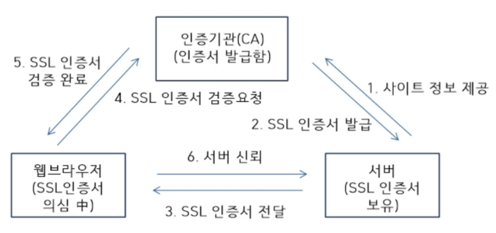

# 네트워크

- TCP vs UDP
  - TCP와 UDP의 차이점에 대해서 설명해보세요.
  - TCP 3, 4 way handshake에 대해서 설명해보세요.
  - OSI 7계층과 그 존재 이유, TCP/IP 4계층에 대해 설명해보세요.
    - 웹 서버 소프트웨어(Apache, Nginx)는 OSI 7계층 중 어디서 작동하는지 설명해보세요.
    - 웹 서버 소프트웨어(Apache, Nginx)의 서버 간 라우팅 기능은 OSI 7계층 중 어디서 작동하는지 설명해보세요.

- HTTP
  - HTTP의 문제점
  - 무상태성과 비연결성에 대해서 설명해주세요.
  - HTTP와 HTTPS의 차이점에 대해서 설명해보세요.
  - HTTPS에 대해서 설명하고 SSL Handshake에 대해서 설명해보세요.
  - SSL 인증서 암호화 기법인 대칭키 암호화 기법, 공개키 암호화 기법에 대해 설명해주세요.
  - Expires, Date, Age, If-Modified-Since의 차이점에 대해 설명해주세요.
  - If-Modified-Since와 If-None-Match의 차이점에 대해 설명해주세요.

- REST API
  - RESTful이란 무엇이며, 이것에 대해서 아는대로 설명해보세요.
  - HTTP 메서드와 이것이 하는 역할에 대해서 설명해보세요.
  - GET과 POST의 차이점에 대해서 설명해보세요.
  - PUT과 PATCH의 차이점에 대해서 설명해보세요.

- 기타
  - CORS(Cross-Origin Resource Sharing)는 무엇인가 왜 이러한 방법이 정의 되었으며, 본인이 코드를 작성하면서 CORS와 관련하여서 경험하였던 이슈는 무엇인가요?
    - same-origin 정책에 대해 설명해주세요.
  - 웹 통신의 큰 흐름: https://www.google.com/ 을 접속할 때 일어나는 일 (DNS round robin 방식)
  - OAuth에 대해서 간단히 설명해주세요.
  - 브라우저 저장소에 대해서 설명해주세요.
    - Session과 Cookie 그리고 Token의 차이에 대해 설명해주세요.
  - 프록시 서버가 필요한 이유

### TCP vs UDP

- [TCP](./tcp.md)
  - TCP vs UDP
  - TCP 특징
  - TCP handshaking

### HTTP
- [HTTP의 정의 & 특징](./http.md)
  - HTTP의 문제점
- HTTPS의 정의 & 특징
- [REST API](./rest_api.md)
  - HTTP Method
  - 비멱등성 API 중복 호출 방지

#### HTTPS

- HTTPS
  - HTTP 프로토콜 내용을 암호화 (HTTP에서 보안성이 추가)
  - HTTP 통신을 하는 과정에서 데이터를 암호화하여 전송하는 방법 (SSL 혹은 TLS라는 알고리즘을 이용)

- HTTPS 특징
  - 인증서
    - 데이터를 제공한 서버가 정말로 데이터를 보내준 서버인지 인증을 확인하는 용도 (데이터 제공자 신원 보장)
    - 인증서 정보에는 서버 도메인 관련 정보가 있어서 데이터 제공자의 인증을 용이하게함 (도메인 종속)
  - CA (Certificate Authority) : 공인 인증서 발급 기관
    - 앞서 말한 인증서를 발급하는 기관, 각 브라우저는 신뢰하는 CA의 정보를 가지고 있음
    - 각 브라우저는 인증서도 차이가 남 (계속 자격을 유지하는 것이 아니라 자격을 박탈당할수도 있다.)
  - 암호화
    - 제 3자가 서버와 클라이언트가 주고받는 정보를 탈취할 수 없도록 하는 것
    - 서버와 클라이언트는 서로가 합의한 방법으로 데이터를 암호화하여 주고 받음

- SSL Handshake
  - 서버는 사전에 미리 CA에게 사이트의 정보를 제공한다
  - CA는 서버를 확인하고, 사전에 SSL 인증서를 서버에 제공한다
  1. 브라우저가 접속을 시도할 때, 서버는 SSL 인증서를 제공한다
  2. 브라우저는 CA에게 SSL 인증서를 검증 요청한다
  3. CA는 전달받은 SSL 인증서를 검증한다
  4. 브라우저는 서버를 신뢰하고 정상적으로 통신을 시작한다

- 대칭키 암호화 기법, 공개키 암호화 기법
  - 공개키 암호화 기법
    - 주로 '개인키' - '공개키'를 쌍으로 사용
    - '공개키'는 암호화 할 때 사용하고, '개인키'는 복호화할 때 사용
    - '개인키'는 서버만 가지고 있고, 사전에 CA에게 공개키를 제공함
    - 클라이언트는 SSL 인증서를 검증받을 때, '공개키'를 건네 받음
  - 대칭키 암호화 기법
    - 암호화, 복호화에 동일한 키를 사용
    - 클라이언트는 서버에게 '대칭키'를 '공개키'로 암호화하여 전달  
    - 서버와 클라이언트가 통신하기 위해 사용
  - 자세한 것은 '참고 자료'를 확인

- 참고 자료 : [HTTPS 통신 과정 쉽게 이해하기](https://aws-hyoh.tistory.com/entry/HTTPS-%ED%86%B5%EC%8B%A0%EA%B3%BC%EC%A0%95-%EC%89%BD%EA%B2%8C-%EC%9D%B4%ED%95%B4%ED%95%98%EA%B8%B0-2Key%EA%B0%80-%EC%9E%88%EC%96%B4%EC%95%BC-%EB%AC%B8%EC%9D%84-%EC%97%B4-%EC%88%98-%EC%9E%88%EB%8B%A4)

#### 캐시 처리를 위한 HTTP Headers

- 캐시 유효 기간 설정
  - Cache-Control: max-age
    - 문서가 처음 생성된 이후부터, 제공하기엔 더 이상 유효하지 않다고 간주될 때까지 경과한 시간을 지정
    - ex) Cache-Control: max-age=484200 (484,200초 동안 유효함) 
  - Expires
    - 문서가 유효한 절대 유효시간을 명시
    - ex) Expires: Fri, 05 Jul 2002, 05:00:00 GMT (해당 날짜 이전까지만 유효함)

- 서버 재검사 
  - 캐시 유효기간이 지났을 때, 클라이언트는 서버에게 정보를 다시 요청한다
  - 응답이 기존과 다를 경우 응답 데이터를 보내지만, 동일할 경우 '304 Not Modified'를 Status line에 담아 응답한다
  - **If-Modified-Since** (IMS 요청)
    - 서버에게 리소스가 특정 날따 이후로 변경에 따른 조건부 요청
    - 가장 흔히 사용되는 캐시 재검사 헤더이다
    - ex) `If-Modified-Since : Fri, 05 Jul 2002, 05:00:00 GMT`
  - **If-None-Match**
    - 요청한 엔터티의 태그 변경에 따른 조건부 요청
    - ex) `If-None-Match : "v2.4", "v2.5", "v2.6"`

- Expires, Date, Age, If-Modified-Since의 차이점
  - **Expires** : 응답이 더 이상 유효하지 않게 되는 일시를 알려준다
    - ex) `Expires: Fri, 05 Jul 2002, 05:00:00 GMT`
  - **Date** : 메시지가 생성된 날짜와 시간을 알려준다
    - ex) `Date: Fri, 05 Jul 2002, 05:00:00 GMT`
  - **Age** : 수신자에게 응답이 얼마나 오래되었는지 말해준다
    - ex) `Age : 60 (초 단위)`
  - **If-Modified-Since** : 마지막으로 요청이 있었을 때를 기준으로, 변경이 있었을 때만 응답을 받음 (조건부 요청)
    - 변경이 없었을 경우, '304 Not Modified'로 응답한다
    - ex) `If-Modified-Since : Fri, 05 Jul 2002, 05:00:00 GMT`
