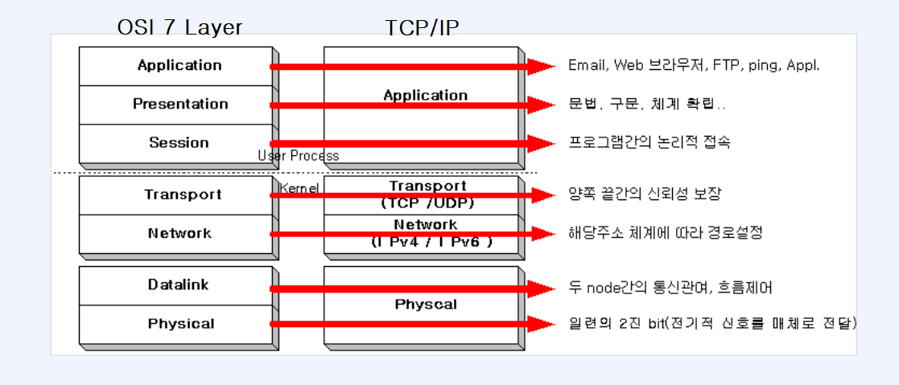

# OSI 7계층

### OSI 7 Layer vs TCP/IP

- OSI 7Layer
  - 네트워크 구성 요소를 7개의 계층으로 역할을 나눈 표준 모델
  - 각 계층별 역할을 통해 규격(Protocol)을 만족
  - 일부 하위계층은 하드웨어에서 구현되며 상위 계층은 소프트웨어로 구현

- TCP/IP (Transmission Control Protocol / Internet Protocol)
  - OSI 7계층이 나오기 전 널리 사용되던 사실상 표준의 역할
  - 각 계층별 역할에 따라 역할이 나누어짐

### OSI 7 Layer
- 계층 구성
  - 7계층 - 응용 계층 : 응용 프로그램과 관련된 계층 (ex. HTTP, FTP, SMTP, DNS)
  - 6계층 - 표현 계층 : 데이터를 번역하고 포장하는 단계 (ex. JPEG, MPEG, SSL/TLS)
  - 5계층 - 세션 계층 : 통신의 시작과 끝을 관리 (ex. Socket)
  - 4계층 - 전송 계층 : 송신자와 수신자의 논리적 연결 담당 (ex. TCP, UDP)
  - 3계층 - 네트워크 계층 : 목적지까지 가는 경로를 찾음 (Routing, IP 주소 이용)
  - 2계층 - 데이터 링크 계층 : 직접 연결된 기기 간의 신뢰성 있는 전송을 담당 (MAC 주소 이용) 
  - 1계층 - 물리 계층 : 데이터를 전기 신호(0과 1)로 변환해서 케이블을 통해 전송
  
- 여러 계층으로 나눈 이유
  - 네트워크 통신 과정을 기능별로 분리하여 표준화
  - 각 계층의 역할을 명확히 해 설계 및 문제 해결을 쉽게 하기 위해

### L4 로드 밸런서 vs L7 로드 밸런서
- L4 로드밸런서
  - 판단 기준: IP 주소 + 포트 번호 (TCP/UDP)
  - 동작 방식: 클라이언트가 보낸 패킷의 헤더만 확인하고 내용을 보지 않은 채 서버로 넘겨준다. (패킷 레벨 로드밸런싱)
  - 장점 : 패킷의 내용을 분석하지 않으므로 속도가 매우 빠르고 부하가 적다.
- L7 로드밸런서
  - 판단 기준: URL, HTTP 헤더, 쿠키, 파일명 등
  - 동작 방식: 로드밸런서가 클라이언트와 연결을 맺고, 요청 내용을 열어본 뒤 적절한 서버로 새로운 연결을 맺어 보낸다 (프록시 역할)
  - 속도가 느리고 CPU 사용량이 높지만, 스마트한 분산이 가능
