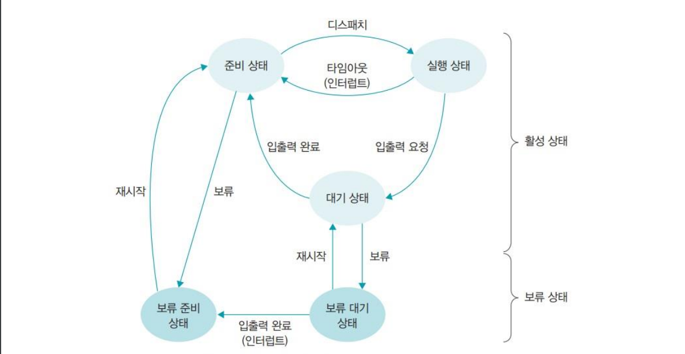

# 운영 체제

- 프로세스
  - 프로세스 관련 용어를 설명해보세요.
  - 프로세스 동기화에 대해 설명해보세요.
    - Critical Section, 해결책
  - 컨텍스트 스위칭에 대해 설명해보세요.

- 스케줄러
  - 스케줄러의 종류 (장기 스케줄러, 단기 스케줄러, 중기 스케줄러)
  - CPU 스케줄러 (FCFS, SJF, SRT, Priority Scheduling, RR)
  - 교착상태와 기아상태의 해결방법에 대해 설명해보세요.

- 멀티 스레드
  - 프로세스와 스레드의 차이를 설명해보세요.
  - 멀티스레드 프로그래밍에 대해 설명해보세요. (장점과 단점)
    - 동기와 비동기의 차이(블로킹, 넌블로킹) / 장단점에 대해 설명해보세요.
  - Thread-safe 하다는 의미와 설계하는 법을 설명해보세요.
  - 세마포어와 뮤텍스의 차이에 대해 설명해보세요.

- 메모리
  - 메모리 관리 전략
    - 메모리 관리 배경, Paging, Segmentation
  - 가상 메모리에 대해 설명해보세요.
    - 배경, 가상 메모리가 하는 일, Demand Paging(요구 페이징), 페이지 교체 알고리즘
  - 캐시의 지역성에 대해 설명해보세요. (Locality, Caching Line)(https://parksb.github.io/article/29.html)

### 프로세스

- 프로세스 : 실행을 위해 메모리에 올라온 동적인 상태
- 프로그램과 프로세스의 관계
  - 프로그램이 운영체제로부터 프로세스 제어 블록(PCB)을 얻으면 프로세스가 됨
  - 프로세스가 종료 → 해당 프로세스 제어 블록(PCB)이 폐기된다는 의미

#### 프로세스 관련 용어

- PCB (프로세스 제어 블록)
  - 프로세스를 실행하는 데 필요한 중요 정보를 관리하는 자료 구조
  - 프로세스는 고유한 PCB를 가짐
  - 프로세스 생성시 만들어져 완료되면 폐기함

- 프로세스의 구조
  - 코드 영역 : 프로그램의 본문이 기술, 탑재된 코드는 읽기 전용으로 처리됨
  - 데이터 영역 : 코드가 실행되면서 사용하는 변수나 파일등의 각종 데이터를 모아놓은 곳, **읽기와 쓰기 모두 가능**
  - 스택 영역 :
    - 운영체제가 프로세스를 실행하기 위해 부수적으로 필요한 데이터를 모아놓은 곳
    - 프로세스 내에서 함수를 호출하면 함수를 수행하고 **원래 프로그램으로 되돌아올 위치를 저장**
    - 사용자에게는 보이지 않음

- 프로세스 상태

#### 프로세스 동기화

- 프로세스 동기화 : 여러개의 프로세스가 동시에 접근할 때, 데이터의 일관성를 유지하기 위한 매커니즘

- Race Condition (경쟁 상태)
  - 여러 프로세스들이 동시에 데이터에 접근하는 상황에서, 어떤 순서로 데이터에 접근하느냐에 따라 결과 값이 달라질 수 있는 상황
- Critical Section (임계 구역)
  - 여러 프로세스(또는 스레드)가 자원을 공유하는 상황에서 하나의 프로세스(스레드)만 접근할 수 있도록 제한해둔 영역
  - 어떤 프로세스가 임계 구역에 들어가면 다른 프로세스는 임계 구역 밖에서 기다려야 하며 임계 구역의 프로세스가 나와야 들어갈 수 있음
  - Race Condition의 해결 방안이 될 수 있다

- 임계 구역 해결 조건
  - **상호 배제 :** 한 프로세스가 임계구역에 들어가면 다른 프로세스는 임계구역에 들어갈 수 없는 것
  - **한정 대기** : 어떤 프로세스도 무한 대기하지 않아야 함
  - **진행의 융통성** : 한 프로세스가 다른 프로세스의 진행을 방해해서는 안 된다는 것
  -
  ex) [데커 알고리즘, 피터슨 알고리즘](https://blog.naver.com/PostView.naver?blogId=jyk2367&logNo=222904880130&parentCategoryNo=&categoryNo=14&viewDate=&isShowPopularPosts=true&from=search)

#### 컨텍스트 스위칭 (문맥 교환)

- CPU를 차지하던 프로세스가 나가고 새로운 프로세스를 받아들이는 작업
- 실행 상태에서 나가는 프로세스 제어 블록에는 지금까지의 작업 내용을 저장, 실행 상태로 들어오는 프로세스 제어 블록의 내용으로 CPU가 다시 세팅
- 이때 두 프로세스 제어 블록(PCB)가 변경된다.
- 문맥 교환을 많이 하게 되면 처리 효율이 떨어지게 되고, 문맥 교환을 적게 하게 되면 아무리 짧은 작업이라고 대기 시간이 길어질 수 있다

### CPU 스케줄러

#### 스케줄러의 종류

- 장기 스케줄러 (long term scheduler)
  - 어떤 프로세스를 **준비 큐**에 넣을 것인가를 결정
  - 전체 시스템의 부하를 고려하여 작업을 시작할지 말지를 결정
  - 작업 대기 → 보류 프로세스
- 중기 스케줄러 (medium term scheduler)
  - **메모리**에 적재된 **프로세스 수 관리**
  - 시스템의 과부하가 걸려서 전체 프로세스 수를 조절해야 한다면 이미 활성화된 프로세스 중 일부를 보류 상태로 보냄
  - 보류 프로세스 ↔ 활성 프로세스
- 단기 스케줄러 (short term scheduler)
  - 메모리 내의 준비 상태에 있는 작업 중 **실행 할 프로세스를 선택하여 CPU를 할당**
  - 어떤 프로세스에 CPU를 할당할지, 어떤 프로세스를 대기 상태에 보낼지 등을 결정
  - 활성 프로세스 ↔ 실행 프로세스

#### CPU 스케줄링

- 선점형 스케줄링과 비선점형 스케줄링

| 구분    | 선점형                                   | 비선점형                                   |
|-------|---------------------------------------|----------------------------------------|
| 작업 방식 | 실행 상태에 있는 작업을 중단시키고 새로운 작업을 실행할 수 있다. | 실행 상태에 있는 작업이 완료될 때까지 다른 작업 실행이 불가능하다. |
| 장점    | 프로세스가 CPU를 독점할 수 없어 대화형이나 시분할 시스템에 적합 | CPU 스케줄러의 작업량이 적고 문맥 교환의 오버헤드가 적다.     |
| 단점    | 문맥 교환의 오버헤드가 많다.                      | 기다리는 프로세스가 많아 처리율이 떨어진다.               |
| 사용    | 시분할 방식의 스케줄러에 사용                      | 일괄 작업 방식 스케줄러에 사용                      |
| 중요도   | 높다                                    | 낮다                                     |

- 비선점형 스케줄링의 종류
  - FCFS 스케줄링 (First Come First Served)
    - 선입선출 스케줄링, 한 번 실행되면 그 프로세스가 끝나야만 다음 프로세스를 실행할 수 있다.
  - SJF 스케줄링 (Shortest Job First)
    - 준비 큐에 있는 프로세스 중에서 실행 시간이 가장 짧은 작업부터 CPU를 할당한다.
    - 아사 현상이 발생할 수 있다
  - HRN 스케줄링 (Highest Response Ratio Next)
    - SJF 스케줄링의 아사 현상을 개선하기 위해 만들어졌다
    - Response Ratio가 가장 높은 프로세스를 선택하여 실행한다
    - Response Ratio : (대기 시간 + 서비스 시간) / 서비스 시간

- 선점형 스케줄링의 종류
  - 라운드 로빈 스케줄링 (RR, Round Robin)
    - 프로세스마다 같은 크기의 CPU 시간을 할당
    - 타임 슬라이스 동안 작업을 하다가 작업을 완료하지 못하면 준비 큐의 맨 뒤로 가서 자기 차례를 기다리는 방식
  - SRT 스케줄링 (Shortest Remaining Time First)
    - 기본적으로 라운드 로빈 스케줄링을 사용
    - CPU를 할당받을 프로세스를 선택할 때 남아있는 작업 시간이 가장 적은 프로세스를 선택
  - 다단계 큐 스케줄링 (Multi Level Queue)
    - 우선 순위(작업들의 종류)에 따라 준비 큐를 여러 개 사용하는 방식
    - 각 큐는 자신만의 독자적인 스케줄링을 가짐
  - 다단계 피드백 큐 스케줄링 (Multi Level Feedback Queue)
    - 입출력 위주와 CPU 위주인 프로세스의 특성에 따라 큐마다 서로 다른 CPU 시간 할당량을 부여
    - 새로운 프로세스는 높은 우선순위을 가지지만 프로세스의 실행 시간이 길어질수록 점점 낮은 우선순위 큐로 이동하며, 마지막 단계에서 FCFS 방식을 적용
    - 낮은 우선순위에 큰 타임 슬라이스를 할당하여 긴 프로세스가 아사하는 것을 보완

#### 교착 상태

- 교착 상태
  - 2개 이상의 프로세스가 다른 프로세스의 작업이 끝나기만 기다리며 작업을 더 이상 진행하지 못하는 상태
  - 다른 프로세스와 공유할 수 없는 자원을 사용할 때 발생한다.
  - ex) 임계 구역의 공유 변수 사용, 데이터베이스의 lock

- 교착 상태 필요 조건 (4가지가 전부 해당해야 됨)
  - **상호 배제**(mutual exclusion) : 한 프로세스가 사용하는 자원은 다른 프로세스와 공유할 수 없는 배타적인 자원이어야 함
  - **비선점**(non-preemptive) : 한 프로세스가 사용 중인 자원은 중간에 다른 프로세스가 빼앗을 수 없는 비선점 자원이어야 함
  - **점유와 대기**(hold and wait) : 프로세스가 어떤 자원을 할당받은 상태에서 다른 자원을 기다리는 상태여야 함
  - **원형 대기**(circular wait) : 점유와 대기를 하는 프로세스 간의 관계가 원을 이루어야 함

- 교착 상태 해결 발법
  - **예방** (prevention) : '교착 상태 필요 조건' 중 하나를 무력화하는 방식
    - _상호 배제 예방_ : 시스템 내에 있는 독점적으로 사용할 수 있는 자원을 없애버리는 방법 (사실 상 어려움)
    - _비선점 예방_ : 모든 자원을 빼앗을 수 있도록 만드는 방법 (아사 현상이 발생할 수 있어 무력화하기 어려움)
    - 점유와 대기 예방 : 프로세스가 자원을 점유한 상태에서 다른 자원을 기다리지 못하게 하는 방법
    - 원형 대기 예방 : 모든 자원에 숫자를 부여하고 숫자가 큰 방향으로만 자원을 할당 (유연성과 숫자 부여 우선 순위의 문제)

  - **회피** (avoidance) : 어느 수준 이상의 자원을 나누어주면 교착 상태가 발생하는지 파악하여 그 수준 이하로 자원을 나누어주는 방법
    - 안정 상태를 유지할 수 있는 범위 내에서 자원을 할당함 으로써 교착 상태를 피함
    - 교착 상태 회피를 구현하는 대표적인 알고리즘 : 은행원 알고리즘

  - **검출**(detection)과 **회복**(recovery) : 교착 상태가 발견하고 해결하는 방식
    - 검출 방법 : 타임 아웃, 자원 할당 그래프의 사이클 확인
    - 회복 방법 : 교착 상태를 일으킨 프로세스 모두 종료, 우선 순위에 따라 하나만 종료

#### 기아 상태 (아사 현상)

- (단기 스케줄러 등에서) 작업 시간이 길다는 이유로 작업이 계속 연기되는 현상
- 해결 방법 : 에이징(aging) - 프로세스가 양보할 수 있는 상한선을 정한다

### 스레드

#### 프로세스 vs 스레드

|  구분   | 프로세스                              | 스레드                                            |
|:-----:|-----------------------------------|------------------------------------------------|
|  정의   | CPU 스케줄러가 CPU에 전달하는 일 하나          | 실행을 위해 메모리에 올라온 프로그램                           |
| 작업 단위 | 운영체제의 작업 단위는 프로세스                 | CPU의 작업 단위는 스레드                                |
|  결합도  | 강함                                | 약함                                             |
| 자원 공유 | - 프로세스 간 통신을 위해 파일, 파이프, 소켓 등이 필요 | - 한 프로세스 내 여러 스레드가 존재   - 코드, 파일 등의 자원을 공유 |

#### 멀티스레드 프로그래밍

- [멀티스레드](./multi_thread.md)
  - 동기 vs 비동기, 블로킹 vs 논블로킹
  - I/O 멀티플렉싱

#### Thread-safe 하다는 의미와 설계

- (추후 작성 예정)

#### 세마포어와 뮤텍스

- 세마포어 (Semaphore)
  - 임계구역에 진입하기 전에 스위치를 사용 중으로 놓고 임계구역으로 들어감
  - 이후에 도착하는 프로세스는 앞의 프로세스가 작업을 마칠 때까지 기다림
  - 프로세스가 작업을 마치면 다음 프로세스에 임계구역을 사용하라는 동기화 신호를 보냄
  - 임계 구역에 들어갈 수 있는 최대 스레드 수를 설정할 수 있다
- 뮤텍스 (Mutex)
  - 세마포어의 한 종류
  - 단 하나의 스레드만 임계 구역에 접근할 수 있다

### 메모리

#### 메모리 관리 복잡성 & 이중성

- 복잡성
  - 메모리는 폰노이만 구조의 컴퓨터에서 유일한 작업 공간이며 모든 프로그램은 메모리에 올라와야 실행 가능
  - 시분할 시스템에서는 운영체제를 포함한 모든 응용 프로그램이 메모리에 올라와 실행되기 때문에 메모리 관리가 복잡함
- 이중성
  - 프로세스 입장에서는 메모리를 독차지하려 하고, 메모리 관리자 입장에서는 되도록 관리를 효율적으로 하고 싶어함

#### 가변 분할 방식, 고정 분할 방식

|   구분   | 가변 분할 방식                      | 고정 분할 방식                               |
|:------:|-------------------------------|----------------------------------------|
|   정의   | 프로세스의 크기에 따라   메모리를 나누는 것 | 프로세스의 크기와 상관없이   메모리를 같은 크기로 나누는 것 |
| 메모리 단위 | 세그멘테이션                        | 페이징                                    |
|   특징   | 연속 메모리 할당                     | 비연속 메모리 할당                             |
|   장점   | 프로세스를 한 덩어리로 관리 가능            | 메모리 관리가 편리                             |
|   단점   | 빈 공간의 관리가 어려움                 | 프로세스가 분할되어 처리됨                         |
|  단편화   | 외부 단편화                        | 내부 단편화                                 |

- 외부 단편화
  - 가변 분할 방식에서 프로세스가 종료된 부분이 띄엄띄엄 있어 해당 크기보다 더 큰 프로세스를 배정하지 못하는 구간
  - 해결 방법 : 메모리 배치 방식 최적화, 조각 모음 실시

- 내부 단편화
  - 고정 분할 방식에서 할당 후에 메모리 단위 크기보다 작은 프로세스를 메모리에 배치하여 공간이 남는 현상
  - 내부 단편화를 줄이기 위해 신중하게 메모리의 크기를 결정해서 나눠야 하지만 사용하는 프로세스의 크기가 제각각이기 때문에 메모리를 얼마로 나누느냐에 관한 정답은 없다

#### 가상 메모리

- 물리 메모리의 크기와 상관없이 프로세스에 커다란 메모리 공간을 제공하는 기술
- 프로세스는 운영체제가 어디에 있는지, 물리 메모리의 크기가 어느 정도인지 신경 쓰지 않고 메모리를 마음대로 사용할 수 있음
- 물리 메모리(실제 메모리, RAM)와 스왑 영역(SSD, HDD)으로 구성
  - 가상 메모리 시스템에서는 두 기법의 단점을 보완한 세그먼테이션-페이징 혼용 기법을 주로 사용

#### Demand Paging(요구 페이징)

- 요구 페이징(demand paging) : 사용자가 요구할 때 해당 페이지를 메모리로 가져오는 것
  - lazy swapper (게으른 스와퍼) : 사용자가 요구할 때 메모리에 올리는 것
  - swapping (순수한 스와핑) : 프로세스를 구성하는 모든 페이지를 메모리에 올리는 것
  - 미리 가져온 데이터가 쓸모없게 되면 피해가 매우 커, 현대의 운영체제는 요구 페이징을 기본으로 사용

- 요구 페이징을 사용하는 이유
  - 메모리를 효율적으로 관리 : 메모리가 꽉 차면 관리하기 어려우므로 적은 양의 프로세스만 유지
  - 응답 속도 향상 : 전부 메모리로 가져와 실행하면 응답이 느려질 수 있으므로 필요한 모듈만 올려서 실행

#### 페이지 교체 알고리즘

- 페이지 교체 알고리즘
  - 스왑 영역으로 내보낼 페이지를 결정하는 알고리즘
  - 메모리에서 앞으로 사용할 가능성이 적은 페이지를 대상 페이지로 선정
  - 페이지 부재를 줄이고 시스템의 성능을 향상을 목적으로 함

- 페이지 교체 알고리즘 종류

| 알고리즘                            | 특징                                                                                                                                                                                        |
|---------------------------------|-------------------------------------------------------------------------------------------------------------------------------------------------------------------------------------------|
| FIFO (First In First Out)       | 처음 메모리에 올라온 페이지를 스왑 영역으로 보냄   → 자주 사용하는 페이지가 선정 될 수 있어 성능이 떨어짐                                                                                                                        |
| 최적                              | 미래의 메모리 접근 패턴을 보고 대상 페이지를 선정하여 스왑 영역을 보냄   → 미래의 접근 패턴을 알기는 불가능에 가깝다                                                                                                                  |
| **LRU (Least Recently Uesd)**   | 가장 오래 전에 사용한 페이지를 스왑 영역으로 옮길 대상으로 선정한다   → 시간 정보를 위한 메모리가 추가로 필요                                                                                                                      |
| **LFU (Least Frequently Uesd)** | 사용 빈도가 적은 페이지를 스왑 영역으로 보낸다.   → 페이지 접근 횟수를 표기하는 추가 공간이 필요                                                                                                                             |
| **NUR (Not Used Recently)**     | 최근에 사용한 적이 없는 페이지를 스왑 영역으로 보낸다.   → 참조 비트, 변경 비트 순으로 고려하여 스왑 영역으로 옮길 대상을 선정   → 불필요한 공간 낭비 문제 해결하여서 가장 많이 사용되고 있다.                                                                |
| FIFO 변형                         | - 2차 기회 페이지 교체 알고리즘 : 특정 페이지에 접근하여 페이지 부재 없이 성공할 경우, 해당 페이지를 큐의 맨 뒤로 이동한다   - 시계 알고리즘 : 원형 큐를 이용하여 스왑 영역으로 보낼 페이지를 가르킴   페이지 부재 없이 성공한 적 있는 경우(비트 값 : 1) 다음 대상을 가르키고 비트 값을 0으로 바꿈 |

### 참고 자료

- [스케줄러의 종류](https://dar0m.tistory.com/247)
- [동기와 비동기의 차이](https://velog.io/@slobber/%EB%8F%99%EA%B8%B0%EC%99%80-%EB%B9%84%EB%8F%99%EA%B8%B0%EC%9D%98-%EC%B0%A8%EC%9D%B4)
- [블로킹 Vs. 논블로킹, 동기 Vs. 비동기](https://velog.io/@nittre/%EB%B8%94%EB%A1%9C%ED%82%B9-Vs.-%EB%85%BC%EB%B8%94%EB%A1%9C%ED%82%B9-%EB%8F%99%EA%B8%B0-Vs.-%EB%B9%84%EB%8F%99%EA%B8%B0)