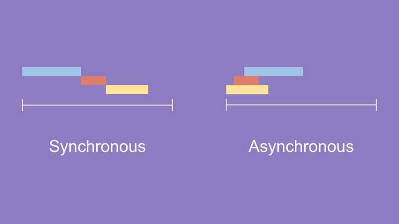
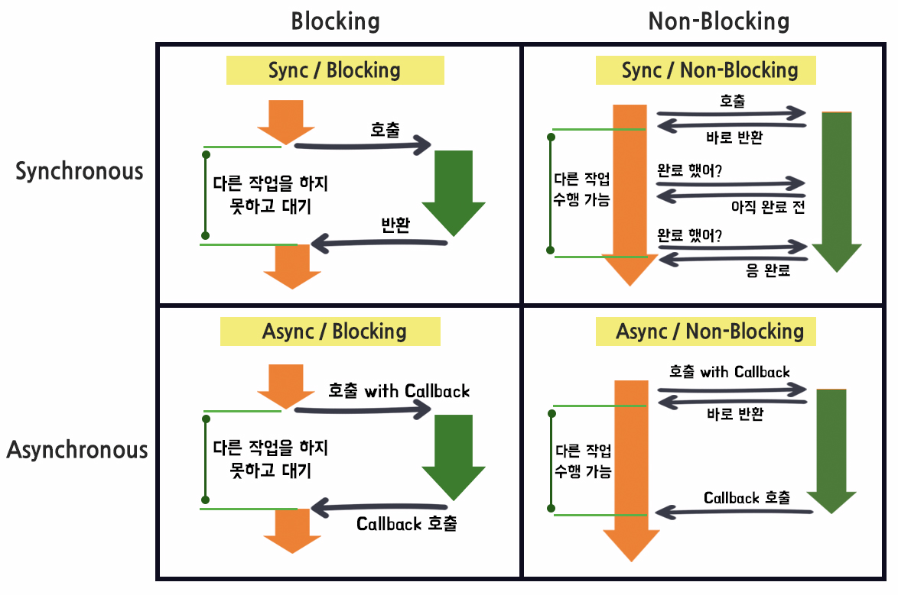

# 멀티스레드
- 스레드 : 한 프로세스 내 작업을 여러개의 스레드로 분할 함으로서 작업의 부담을 줄임
- 객체를 확장하여 스레드를 만들고 코드, 파일 등의 자원을 공유
- 장점 : 응답성 향상, 자원 공유, 효율성 향상, 다중 CPU 지원
- 단점 : 한 스레드에 문제가 생기면 전체 프로세스에 영향을 미침

### 동기 vs 비동기 (요청의 기다림)

- 동기(synchronous) : 데이터의 요청과 결과가 한 자리에서 동시에 일어나는 것
  - 요청을 하면 시간이 얼마나 걸리던지 요청한 자리에서 결과가 주어져야 한다
  - 장단점 : 설계가 매우 간단하고 직관적이지만, 앞 작업이 길어져도 대기해야만 한다
- 비동기(Asynchronous) : 데이터의 요청이 끝났는지와 상관없이 실행하는 것
  - 데이터를 요청한 후 요청에 따른 응답을 계속 기다리지 않고 외부 활동을 할 수 있다
  - 장단점 : 효율이 증가하나, 동기식보다 설계가 복잡하다

### 블로킹 vs 논블로킹 (제어권)
- 블로킹 (blocking) : A 함수가 B 함수를 호출하면, 제어권을 A가 호출한 B 함수에 넘겨준다
- 논블로킹 (non-blocking) : A 함수가 B 함수를 호출해도, 제어권은 그대로 자신이 가지고 있는다

### 동기와 블로킹

### I/O 멀티플렉싱
- 정의 : 하나의 프로세스(또는 스레드)가 여러 개의 입출력 작업을 동시에 모니터링하고, 데이터가 준비된 파일 디스크립터를 식별하여 처리할 수 있도록 하는 기술
  - 파일 디스크립터 : 파일, 소켓, 파이프와 같이 입출력 자원에 접근하기 위해 사용하는 정수 값

- 작동 원리
  1. 프로세스는 I/O 멀티플렉싱 시스템 호출을 사용하여 관심 있는 파일 디스크립터 목록을 커널에 전달
  2. 여러 FD 중 하나라도 준비될 때까지, 해당 프로세스는 이 시스템 호출에서 블록된다.
  3. 커널은 모니터링 중인 FD 중 하나 이상에서 데이터 수신 준비, 데이터 전송 가능, 오류 발생 등의 이벤트가 발생하면, 대기 중인 프로세스를 깨운다.
  4. 프로세스는 시스템 호출의 반환 값을 확인하여 실제로 I/O가 가능한 상태가 된 FD만 선택하여 실제 I/O 작업을 논블로킹 방식으로 수행

- 장점
  - 단일 스레드로 다중 연결 처리: 하나의 스레드/프로세스가 여러 클라이언트 연결(FD)을 효율적으로 처리할 수 있어 자원 소모(메모리, CPU 문맥 교환 오버헤드)를 절약
  - 성능 향상: 특히 동시 접속자 수가 많고, 각 연결의 I/O 작업이 대부분 대기 상태인 환경에서 높은 처리량을 제공
  - 확장성: 전통적인 '프로세스/스레드당 클라이언트' 모델보다 더 많은 동시 연결을 처리할 수 있어 높은 확장성을 가짐

- [참고 자료](https://velog.io/@wken5577/IO-%EB%A9%80%ED%8B%B0%ED%94%8C%EB%A0%89%EC%8B%B1IO-Multiplexing)
