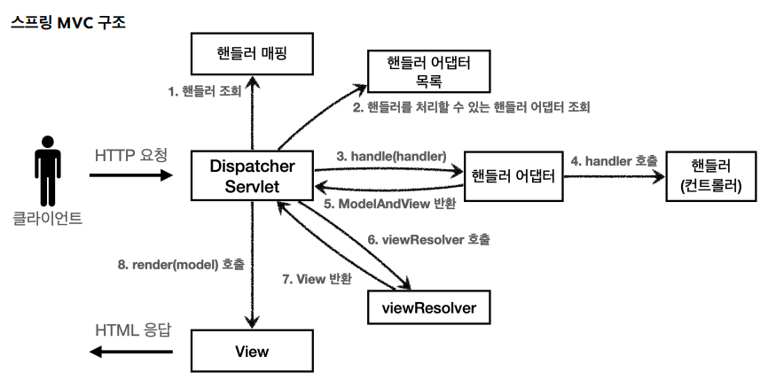
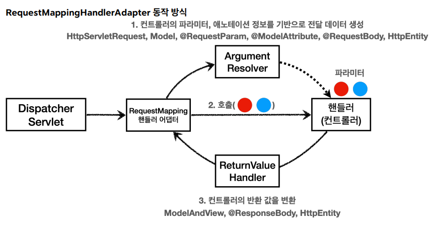

# Spring MVC

### Spring MVC의 구조

- `DispatcherServlet` : `HttpServlet` 을 상속 받아서 사용하고 서블릿으로 동작 (Front Controller 패턴)

- `HandlerMapping` : 핸들러 조회 (여러 개의 `HandlerMapping`이 각각 핸들러를 관리)
  - `RequestMappingHandlerMapping` : 애노테이션 기반의 컨트롤러인 `@RequestMapping`에서 사용
  - `BeanNameUrlHandlerMapping` : 스프링 빈의 이름으로 핸들러를 찾는다.

- `HandlerAdapter` : 핸들러를 처리할 수 있는 핸들러 어뎁터 조회 (`supports(Object handler)` 메서드를 사용하여 적절한 어뎁터인지를 판단)
  - `RequestMappingHandlerAdapter` : `@RequestMapping`에서 사용
  - `HttpRequestHandlerAdapter` : HttpRequestHandler 처리
  - `SimpleControllerHandlerAdapter` : Controller 인터페이스 처리

- `ModelAndView` : 핸들러가 반환하는 정보(형식)

- `ViewResolver` : 뷰의 논리 이름을 물리 이름으로 바꾸고, 렌더링 역할을 담당하는 뷰 객체를 반환

- `View` : 렌더링 역할을 담당

### `HandlerAdapter` - `Handler` 간 동작

- `RequestMappingHandlerAdapter`의 동작 방식
  - `ArgumentResolver` : 컨트롤러(핸들러)가 필요로 하는 다양한 파라미터의 값(객체)을 생성, 이렇게 파리미터의 값이 모두 준비되면 컨트롤러를 호출하면서 값을 넘겨줌, 30개가 넘는 종류를 기본으로 제공
  - `ReturnValueHandler`(`HandlerMethodReturnValueHandler`) : 응답 값을 변환하고 처리 (ex. `ModelAndView`, `@ResponseBody`, `HttpEntity`, `String`)

- `Converter` (스프링 타입 컨버터) : 
  - https://rebugs.tistory.com/640
- `HandlerExceptionResolver` : 핸들러 어뎁터를 통해 실행 시 예외 처리
  - `ExceptionHandlerExceptionResolver` : `@ExceptionHandler`가 있는 경우
  - `ResponseStatusExceptionResolver` : 해당 Exception에 `@ResponseStatus`가 있는 경우
  - `DefaultHandlerExceptionResolver` : Spring 내부 오류
  - 처리 가능한 핸들러가 없는 경우, Tomcat까지 전파

