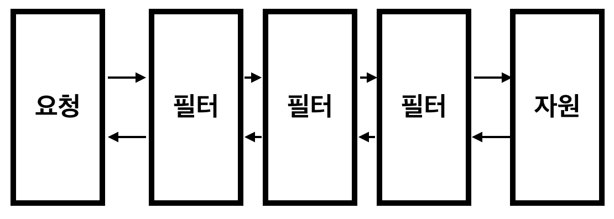

# 필터와 인터셉터

### 필터 vs 인터셉터

| 구분 | 필터 (Filter) | 인터셉터 (Interceptor) |
| :---: | :--- | :--- |
| 적용 시점 (범위) | 서블릿 컨테이너 레벨 | Spring MVC 레벨 |
| 관리 주체 | 서블릿 컨테이너 (ex. Tomcat) | Spring 컨테이너 (Spring MVC가 제공) |
| Spring 빈 접근 | 어렵거나 별도 설정 필요 (스프링 컨테이너 외부에서 동작) | 용이함 (스프링 컨테이너 내에서 동작하므로) |
| 주요 역할 및 예시 | 모든 요청에 대한 공통적이고 광범위한 처리 (인코딩, 보안/인증 전처리, 로깅, 이미지 압축) | Controller와 관련된 세부적인 처리 (인증/권한 체크, 요청 데이터 가공, 로깅, Controller 실행 시간 측정) |

### 체인 형식의 관리

- 필터 체인 (Filter Chain)
  - 서블릿 컨테이너가 관리하며, 요청 URI 패턴에 매핑된 여러 개의 필터를 순서대로 묶어 놓은 것입니다.
  - 요청이 들어오면 첫 번째 필터부터 실행되며, 각 필터는 `chain.doFilter(request, response)`를 호출하여 다음 필터로 제어권을 넘깁니다.
  - 만약 필터 중 하나가 `chain.doFilter()`를 호출하지 않으면, 요청은 그곳에서 멈추고 Dispatcher Servlet이나 이후의 필터로 진행되지 않습니다.
- 인터셉터 실행 체인 (HandlerExecutionChain)
  - Spring의 Dispatcher Servlet 내부에서 관리하며, 요청을 처리할 Controller(Handler)와 그 Controller에 적용될 여러 개의 인터셉터를 묶어 놓은 것
  - Dispatcher Servlet이 요청을 받으면, 요청에 맞는 Controller를 찾고, 해당 Controller에 적용되는 인터셉터들을 이 체인으로 구성
  - `preHandle()` : 인터셉터의 등록된 순서대로 실행 (하나라도 false를 반환하면 실행 중단)
  - `postHandle()` : Controller가 정상 실행되면 역순으로 실행
  - `afterCompletion()` : 에러 발생 여부와 무관하게 메서드가 역순으로 실행

### `DelegatingFilterProxy`
- 목적 : 서블릿 컨테이너 레벨의 필터가 Spring 컨테이너의 기능을 사용할 수 있도록 한다.
- 동작 방식
  1. 서블릿 컨테이너로부터 요청을 받는다.
  2. Spring 컨테이너에서 자신이 위임할 대상 필터(Bean)를 조회
  3. 조회한 실제 필터 Bean으로 요청을 위임하여 Spring Bean의 기능을 수행

### AOP vs 인터셉터

| 구분 | 인터셉터 (Interceptor) | AOP (Aspect-Oriented Programming) |
| :---: | :--- | :--- |
| 대상 범위 | Spring MVC의 Controller 호출 전/후 | Spring Bean의 모든 메서드 호출 전/후 |
| 작동 위치 | Dispatcher Servlet 내부 (HandlerExecutionChain) | 프록시 기반으로 Bean 객체를 감싸서 작동 (대부분 런타임 시점) |
| 주요 활용 | 웹 계층의 인증, 권한, 로깅, 다국어 처리 등 공통 웹 로직 | 비즈니스 로직 계층의 트랜잭션, 캐싱, 보안, 메서드 실행 시간 측정 등 횡단 관심사 |
| 결합도 | Spring MVC에 대한 높은 의존성 | 핵심 비즈니스 로직(Core Concern)과 횡단 관심사를 분리하여 낮은 결합도 유지 |
